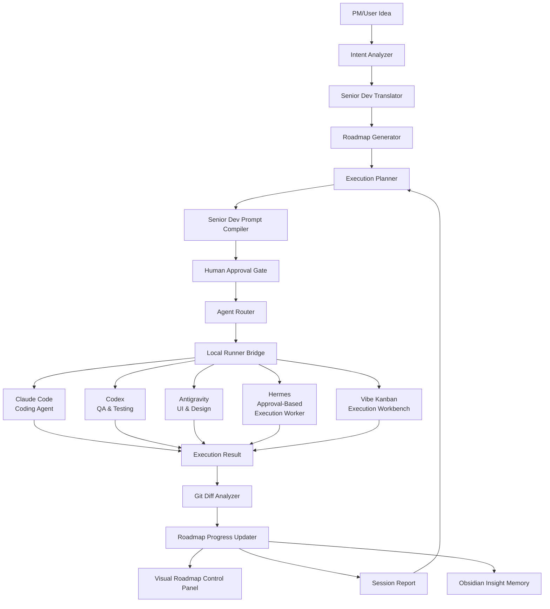

# ARCHITECTURE.md — Agent Control Room

## 1. Architecture Goal
Agent Control Room is an **AI Development Control Tower for non-developer PMs**.
It is not merely a CLI execution wrapper or prompt generator. It is an operational control tower where a PM or non-developer inputs an idea or product direction, and the system translates it into requirements, generates a visual roadmap, delegates tasks to appropriate AI coding agents or workbenches (Claude Code, Codex, Antigravity, optional Hermes, Vibe Kanban), tracks execution, analyzes results/diffs, preserves knowledge, and orchestrates the transition to the next step.

The target architecture is **orchestrator plus workbench**:
- Agent Control Room is the brain: intent, planning, routing, prompts, approvals, handoffs, and next-step reasoning.
- Vibe Kanban is the workbench: issue cards, workspace/session execution, git worktrees, diff/review UI, and previews.
- The app should not spend MVP effort rebuilding Vibe Kanban's strongest surfaces. It should bridge to them and reserve its own UI for control, context, and decisions.

## 2. System Overview
### 2.1 Core Loop
The orchestration follows a continuous iterative loop:
```txt
Idea / Product Direction
        ↓
Senior Dev Translator
        ↓
Roadmap Generator
        ↓
Visual Development Roadmap Control Panel
        ↓
Task Decomposer & Agent Router
        ↓
Senior Dev Prompt Compiler
        ↓
Human Approval
        ↓
Agent Execution or Vibe Kanban Workbench
        ↓
Git Diff & Outcome Analyzer
        ↓
Roadmap Updater, Insight Memory & Next Prompt Generator
```

### 2.2 Target Architecture Layers



| Layer | Responsibility |
|---|---|
| **Intent Analyzer** | Parses user's natural language request to identify goals, constraints, and scope. |
| **Senior Dev Translator** | Converts rough non-developer ideas into product and implementation context. |
| **Roadmap Generator** | Breaks the goal into roadmap stages that can be visualized and checked off. |
| **Execution Planner** | Organizes task sequence, dependencies, and execution strategy. |
| **Senior Dev Prompt Compiler** | Produces precise prompts with goal, context, scope, non-goals, file boundaries, acceptance criteria, checks, and handoff rules. |
| **Human Approval Gate** | User reviews and approves execution before proceeding. Token issued for one-time execution. |
| **Agent Router** | Selects the appropriate local tool or workbench (Claude Code, Codex, Antigravity, Hermes, or Vibe Kanban). |
| **Local Runner Bridge** | Integrates with already-authenticated local tools. No external paid APIs called by default. See `LOCAL_RUNNER_ARCHITECTURE.md`. |
| **Agent Execution (Local)** | Safely executes local tool (e.g. Claude Code via `child_process.spawn("claude", ...)`) within an isolated git branch. |
| **Git Diff Analyzer** | Inspects `git diff` to understand what the agent actually changed. |
| **Roadmap Progress Updater** | Marks stages/tasks as completed, active, waiting, blocked, or user-input-required based on analysis. |
| **Visual Roadmap Control Panel** | Presents the product roadmap, check marks, current task, next action, responsible agent, blockers, acceptance criteria, and prompts. |
| **Vibe Kanban Workbench** | Integration with Vibe Kanban for richer board, workspace, agent session, diff/review, and preview surfaces. |
| **Obsidian Insight Memory** | Exports durable decisions, insights, prompt patterns, handoffs, and agent performance notes as Markdown. |
| **Session Report** | Documents the outcome of a session, generating the next prompt. |

## 3. Core Modules (Implemented & Future)

### 3.1 Project Registry & Reader
Stores projects and reads context from `AGENT_STATE.md`, `TASKS.md`, `HANDOFF.md`, etc.

### 3.2 Technical Translator & Decomposer
Converts product direction into small executable tasks. (Currently mapped to Direction to Prompt & Advisor Mode).

### 3.3 Advisor Mode (T015)
When execution is blocked or ambiguous, this module provides interpretation, options, recommendations, and generates a copy-ready prompt for the next step.

### 3.4 Control Panel & Plan View (T017)
Visualizes the product roadmap and task statuses. The next direction is to make `/plan` a Visual Development Roadmap Control Panel: completed stages show check marks, active stages show current task and responsible agent, waiting stages show start conditions, and blocked/user-input-required stages show the exact decision needed. It may show lightweight kanban elements, but it should not grow into a duplicate of Vibe Kanban's full execution board.

### 3.5 Local Runner Bridge
The integration layer between Agent Control Room and already-authenticated local tools.

**Does NOT call external paid APIs by default.**

Instead, it:
- Routes to appropriate local tool adapter (Claude Code CLI, Codex, Antigravity, Vibe Kanban)
- Manages approval tokens (server-issued, context-bound, one-time use)
- Validates execution context (project path, agent allowlist, uncommitted changes)
- Creates isolated git branches for execution
- Spawns local tool processes
- Captures logs and results
- Analyzes diffs

See `LOCAL_RUNNER_ARCHITECTURE.md` for full details on execution adapters and safety boundaries.

### 3.6 Agent Execution Runner (T018)
The local tool adapter that invokes Claude Code or other local tools. It manages:
- Creating safe git worktrees/branches.
- Spawning the local tool CLI process (e.g. `claude -p "..."`, not external API).
- Streaming stdout/stderr logs via SSE.
- Capturing the exit code.
- No external paid API calls.

### 3.7 Diff & Outcome Analyzer (T019)
Replaces manual session reporting. It reads `git diff --name-only` and `git diff`, sends it to an LLM, and automatically determines which tasks were completed and what files were modified.

### 3.8 Agent Availability Manager
Tracks agent availability manually in MVP. Supported statuses are `available`, `cooling_down`, `token_limited`, `blocked`, `context_overloaded`, `manual_only`, and `experimental`. If an agent is unavailable, the system generates a fallback handoff or Context Pack instead of pretending execution can continue normally.

### 3.9 Context Reset Protocol
When context is too long, token-limited, blocked, or ready for a new agent/session, generate a Context Pack with current goal, completed work, changed files, decisions, blockers, remaining work, next task, acceptance criteria, do-not-do rules, and the next prompt. Do not depend on literal `/clear` automation.

### 3.10 Obsidian Knowledge Memory
Future module for exporting development insights, decisions, failed attempts, successful prompt patterns, agent performance notes, handoffs, and checklists as Obsidian-compatible Markdown.

### 3.11 Hermes Approval-Based Execution Worker
Hermes is the **operational monitoring, packet, and approval-support worker**. It is NOT a secondary coding agent.

**Hermes responsibilities**:
- Terminal/status checks and operational summaries where explicitly approved
- Operational automation (log summaries, failure analysis, monitoring)
- Approval workflows (Telegram request formatting/client support for high-risk operations)
- Result collection (analyzing Phase completion, summarizing agent outcomes)
- Memory and reporting (Obsidian notes, Orchestration Packets, Session summaries)

**Hermes constraints**:
- Cannot modify code files during agent execution
- High-risk work such as git push, production deployment, dependency changes, and DB migrations requires explicit approval; Telegram response intake can persist responses and update matching in-memory dispatch jobs, but durable multi-process approval synchronization is still pending
- Always returns major results to Agent Control Room (not autonomous endpoint)
- Uses Gemini API initially, with OpenAI API fallback

See [[docs/HERMES_BACKGROUND_WORKER.md]] and related policy docs for complete Hermes role definition.

## 4. Open-Source Integration (Vibe Kanban)
Agent Control Room integrates with **Vibe Kanban** (open-source) as an execution workbench and issue/workspace surface.

### 4.1 Vibe Kanban Bridge
- **Purpose**: Send prepared feature plan tasks → Vibe Kanban issues/workspaces for execution visibility and richer agent-session workflows
- **API Mode**: HTTP API to `/api/remote/issues` (real-time issue creation)
- **Mock Mode**: Fallback when `VIBE_KANBAN_URL` is not set (development mode)
- **Project Selection**: Dialog-based UI in `SendToVibeKanbanButton.tsx`
  - User selects organization ID (env var or manual input)
  - Fetches project list from Vibe Kanban → `/api/vibe-kanban/projects`
  - Fetches status list from selected project → `/api/vibe-kanban/statuses`
  - Creates issue with selected project_id + status_id

### 4.2 Brain vs Workbench Boundary
- Agent Control Room drives orchestration decisions.
- Vibe Kanban handles detailed execution-board/workspace surfaces.
- One-way sync is acceptable for issue creation, but the next bridge should support result readback: Vibe Kanban execution outcome → Agent Control Room session report / diff summary / next prompt.
- Do not deep-fork Vibe Kanban before the API/MCP bridge proves durable.

### 4.3 UI Boundary
- `/plan` should act as the Visual Development Roadmap Control Panel.
- Vibe Kanban should be opened, linked, embedded, or synchronized for detailed board/workspace work.
- Avoid building duplicate internal card/session/diff UI when Vibe Kanban already provides a better version and a stable bridge exists.

## 5. Storage Layer (Dual-Mode)

Agent Control Room uses a **fallback pattern** for data persistence:

### 5.1 Primary: Supabase PostgreSQL
When `NEXT_PUBLIC_SUPABASE_URL` is configured:
- **Tables**: 7 core tables (projects, tasks, handoffs, session_reports, feature_plans, execution_logs, agent_statuses)
- **RLS**: Row-level security enabled (allow-all for single-user personal tool)
- **Fallback**: If query fails, automatically switches to local JSON

### 5.2 Fallback: Local JSON Files
When Supabase is not configured or unavailable:
- **Files**: `data/projects.json`, `data/tasks.json`, `data/feature-plans.json`, `data/session-reports.json`, `data/handoffs.json`, `data/execution-logs.json`, `data/agent-statuses.json`
- **Benefits**: Zero-dependency local development, offline support
- **No Schema Sync**: JSON format is maintained; Supabase schema is optional

### 5.3 Storage Adapters
All storage operations go through `lib/storage/*.ts`:
- `json-store.ts` — Projects, session reports
- `feature-plan-store.ts` — Feature plans, Kanban updates
- `execution-log-store.ts` — Execution logs
- `agent-status-store.ts` — Agent status tracking

Each adapter checks `getSupabaseClient()` first, falls back to JSON if unavailable.

## 6. Development Phases

- **Phase 1-8 (DONE)**: Manual orchestration, planning, execution, routing, autonomous loop, security hardening.
- **Phase 9 (DONE)**: Roadmap-first Control Tower UX, visual development panel, agent status manager.
- **Phase 10-11 (DONE)**: Vibe Kanban workbench integration, prompt compilation, deployment readiness.
- **Phase 12-16 (DONE)**: Core autonomous orchestration loop, task scheduling, result classification, Hermes monitoring.
- **Phase 17-22 (DONE)**: Orchestration adapters, control panel UX, logs API, Hermes insight panel.
- **Phase 28-32 (DONE)**: Real CLI integration, Vibe Kanban HTTP API, destructive pattern detector, context budget management.
- **Phase 33-34 (DONE)**: Production hardening, error recovery, LLM-assisted validation, auto-decision layer.
- **Phase 35-36 (DONE)**: Multi-project orchestration, concurrent queue management, real-time dashboard.
- **Phase 37-39 (DONE)**: Hermes Telegram integration, OrchestrationPacket formalization, risk classification engine.
- **Phase 40 (DONE)**: Planning→Orchestration auto-connection via localStorage bridge pattern.
- **Phase 41 (DONE)**: Natural language project-aware orchestration — project analyzer, context store, LLM decision engine, CLI patch tool.
  - Project file analysis and framework detection
  - Automatic project context injection into planning chat
  - `gpt-5-mini` based natural language orchestration decisions
  - Decision source transparency (LLM vs rule-based tracking)
  - CLI tool for AI-suggested file modifications
  - Deployed to Vercel with 0 TypeScript errors

**Next Phases**:
- **Phase 42+**: Supabase durable storage, real Telegram bot integration, Obsidian memory loop, production monitoring.

*(For detailed Task and Data Models, see `TASK_MODEL.md` and `ROADMAP.md`)*
