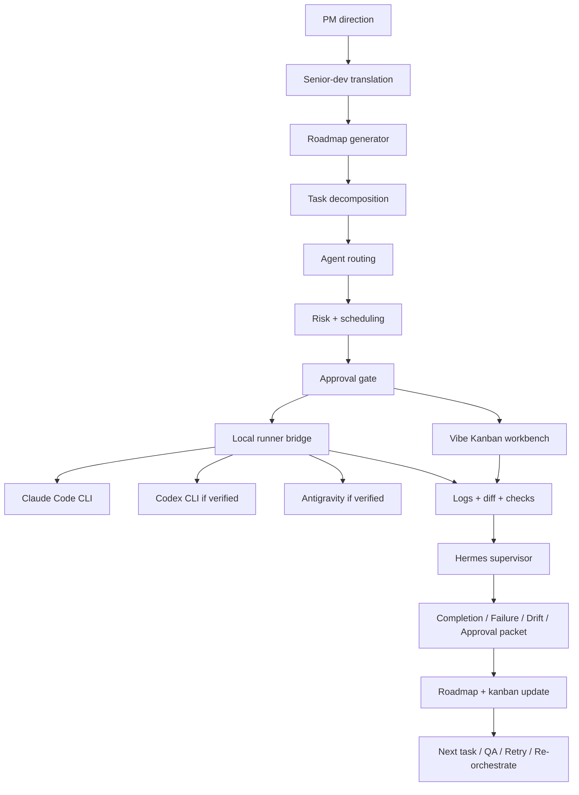

# ARCHITECTURE.md — Agent Control Room

## 1. Architecture Goal

Agent Control Room is a **roadmap-driven local AI development automation control tower for non-developer PMs**.

The target architecture is not "prompt generator plus handoff notes." It is:

```text
roadmap brain + local runner + Hermes supervisor + detailed workbench bridge
```

Agent Control Room owns product intent, roadmap, task decomposition, routing, risk, approvals, result interpretation, and re-orchestration.

Vibe Kanban owns or inspires detailed cards, workspaces, agent sessions, diffs, and previews.

Hermes supervises execution. Hermes does not code.

## 2. Core Loop (Phase E Implementation)

**Planning → Execution:**
```text
Planning intent
  ↓
Roadmap generator (/plan)
  ↓
Task decomposer with acceptance criteria
  ↓
Agent router + capability explanation
  ↓
Risk classifier + scheduling selector
  ↓
Approval gate (blocks high/critical)
  ↓
Local runner (/api/runner) or workbench
```

**Execution → Result:**
```text
Local runner or workbench executes
  ↓
ExecutionLog persisted (status: done/failed/boundary_violation)
  ↓
Result normalization: normalizeExecutionResult()
  → ExecutionResultSummary with status, checks, changedFiles
  ↓
Decision classification: classifyExecutionDecision()
  → DecisionClassification with decision, reason, nextAction
  ↓
Status update: updateRoadmapAndKanbanStatus()
  → PlanTask status changed to: done/blocked/needs_review/ready
  ↓
(Phase F) Packet generation: buildHermesPacket()
  → HermesPacket (typed supervision result) — currently on-demand only
  ↓
Result display and next-action recommendation
  ↓
Next task, retry, QA, pause, or re-orchestration
```

## 3. Architecture Layers (Phase E Status)

| Layer | Status | File(s) |
|---|---|---|
| Roadmap Generator | ✅ Implemented | `lib/storage/feature-plan-store.ts` |
| Task Decomposer | ✅ Implemented | `lib/types.ts` (PlanTask) |
| Agent Router | ✅ Implemented | Risk-based in task definition |
| Risk Classifier | ✅ Implemented | `lib/control-room/risk-classifier.ts` |
| Scheduling Selector | ✅ Implemented | `lib/orchestration/scheduling-mode-selector.ts` |
| Approval Gate | ✅ Implemented | `app/api/workbench/approval/route.ts` |
| Local Runner Bridge | ✅ Implemented | `app/api/runner/route.ts` |
| Execution Log | ✅ Implemented | `lib/storage/execution-log-store.ts` |
| Result Normalizer | ✅ Implemented | `lib/runner/execution-result-normalizer.ts` |
| Decision Classifier | ✅ Implemented | `lib/orchestration/decision-classifier.ts` |
| Status Updater | ✅ Implemented | `lib/orchestration/status-updater.ts` |
| Hermes Packet Builder | ✅ Implemented | `lib/hermes/packet-builder.ts` |
| Hermes Packet Wiring | ✅ Implemented | Packets auto-generated on execution completion (Phase 2) |
| Hermes Insight Recorder | ✅ Implemented | `lib/hermes/insight-recorder.ts` |
| Hermes Insight Display | ✅ Implemented | `app/orchestration/components/HermesInsightPanel.tsx` |
| Roadmap UI | ✅ Implemented | `app/plan/page.tsx` |
| Workbench UI | ✅ Implemented | `app/workbench/page.tsx` |
| Orchestration UI | ✅ Implemented | `app/orchestration/page.tsx` |
| Vibe Kanban Bridge | ✅ Implemented | `lib/orchestration/project-store.ts` |

## 4. Mermaid Overview



## 4a. Phase 2: Multi-Agent Orchestration Loop

**Result → Next Task Routing (Phase 2 Addition):**
```text
Hermes Packet generated
  ↓
Result classification (pass/fail/qa_needed/retry_needed/blocked/drift_detected)
  ↓
Next task recommendation (classifyExecutionDecision → generateNextTask)
  → Task type determined: continue_next, fix, qa, retry, manual_review, re-orchestrate
  → Risk level assigned
  → Agent routed: Claude Code (auto-run eligible), Codex (QA-only, auto-run DISABLED), Antigravity (manual-only)
  → Execution mode selected: sequential vs parallel_safe (with file-conflict detection)
  → File boundary preserved (critical files protected)
  ↓
Parallel safety check (parallel-safety-decider.ts)
  → Conflict detection across pending tasks
  → Sequential-only enforcement for shared files, high/critical risk
  ↓
Hermes Insight recorded (execution patterns, file boundary violations)
  → Insight severity: info, warning, critical
  → Surfaced in Orchestration UI
  ↓
Next dispatch to agent or approval queue
```

**Multi-Agent Routing Rules (Phase 2):**
- **Claude Code** — Architecture, complex reasoning, low-risk auto-run eligible
- **Codex** — QA, tests, type errors, bounded fixes; auto-run DISABLED by design
- **Antigravity** — UI/UX; auto-run DISABLED (not CLI agent)
- **Hermes** — Supervision, insights, recommendations; no code edits

## 5. Local Runner Boundary

The local runner is for already-authenticated local tools. It must:
- require server-issued, context-bound approval tokens where execution is risky
- validate cwd and agent allowlists
- create or use safe branches/workspaces
- stream logs
- capture exit status
- capture git diff
- run/check validation commands when configured
- return results to Agent Control Room

It must not:
- bypass approval gates
- run production deploys
- run DB migrations
- push, merge, rebase, reset, or clean git state without explicit future policy
- modify secrets

See `docs/LOCAL_RUNNER_ARCHITECTURE.md`.

## 6. Hermes Boundary (Phase E/F/2 Implementation)

Hermes is a **Background Execution Supervisor** — not a coding agent.

**Phase E Implementation:**
- Result Normalizer (`execution-result-normalizer.ts`) — Pure function, no shell
- Decision Classifier (`decision-classifier.ts`) — Rules-based, 8-rule priority order
- Packet Builder (`packet-builder.ts`) — Generates PM-friendly supervision packets
- Status Updater (`status-updater.ts`) — Updates roadmap/kanban based on classification

**Phase 2 Addition:**
- Hermes Insight Recorder (`insight-recorder.ts`) — Captures execution patterns, file boundary violations
- Hermes Insight Display Panel (`HermesInsightPanel.tsx`) — Shows recommendations in UI
- Next Task Generator (`next-task-generator.ts`) — Decision-to-task mapping
- Parallel Safety Decider (`parallel-safety-decider.ts`) — Conflict detection
- Agent Router Enhancement (`next-task-router.ts`) — Multi-agent capability routing with auto-run restrictions

**Packet Types Supported:**
- Phase Success Packet (PhaseSuccessPacket)
- Phase Failure Packet (PhaseFailurePacket)
- Drift Detection Packet (DriftDetectionPacket)
- Approval Request Packet (HermesApprovalRequestPacket)

**Current State (Phase 2):**
- ✅ Packets automatically generated on runner completion
- ✅ Status updates (roadmap/kanban) happen based on classification results
- ✅ Hermes insights captured and displayed
- ✅ Next task recommendations routed to appropriate agent with safety restrictions
- ✅ Parallel execution decisions made with file-conflict detection

**Hermes must never:**
- Edit code
- Run git push/merge/rebase/reset/clean
- Change dependencies
- Deploy to production
- Modify secrets or .env
- Run database migrations
- Take over coding-agent work

See `docs/HERMES_BACKGROUND_WORKER.md`.

## 7. UI Architecture

| Route / Component Area | Architecture Role |
|---|---|
| `/plan` | Main roadmap control panel. |
| `components/roadmap/*` | Roadmap status, timeline, stage cards, summary widgets. |
| `components/plan/*` | Kanban-style detail view for tasks. |
| `/workbench` | Execution readiness, approval, scheduling explanation, runner launch. |
| `/orchestration` | Dispatch queue, approvals, validation, auto-decision suggestions, logs, feedback. |
| `components/orchestration/*` | Approval Gate, Auto Decision, validation, metrics, monitor views. |
| `components/agents/*` | Agent capability and status explanation. |
| Hermes components | Supervision packets, summaries, context packs, reports. |

## 8. Storage (Phase E Implementation)

**In-Session JSON Storage:**
- `data/feature-plans.json` — Roadmap and task state
- `data/execution-logs.json` — ExecutionLog records
- `data/approval-tokens.json` — Approval token state (short-lived)

**Data Structures:**
- FeaturePlan, PlanTask, PlanPhase (roadmap)
- ExecutionLog (logs, status, changed files)
- ExecutionResultSummary (normalized result)
- DecisionClassification (decision logic output)
- HermesPacket union (typed supervision result)

**Persistence Strategy:**
- ✅ Transactional JSON updates (read → modify → write)
- ✅ Plan/task status synced immediately
- ✅ Execution logs persisted at start and completion
- ⚠️ No multi-user locking (single-user MVP)
- ⚠️ Supabase durable storage is Phase F+ backlog

**What's Stored:**
- Project and roadmap state
- Task state and assignment
- Execution logs and results
- Approval token validation state
- Hermes packet builders (buildable, stored on-demand)

## 9. Key Implementation Files (Phase E/2)

**Core Flow:**
- `/api/runner/route.ts` — Local execution endpoint, SSE-streamed logs
- `/api/runner/result-summary/route.ts` — Normalized result lookup
- `/api/workbench/approval/route.ts` — Approval token generation
- `lib/runner/execution-result-normalizer.ts` — Result normalization (pure function)
- `lib/orchestration/decision-classifier.ts` — Decision logic (rules-based)
- `lib/orchestration/status-updater.ts` — Roadmap/kanban sync
- `lib/hermes/packet-builder.ts` — Packet generation (auto on completion)

**Phase 2 Multi-Agent Orchestration:**
- `lib/orchestration/next-task-generator.ts` — Decision-to-task mapping
- `lib/orchestration/next-task-router.ts` — Agent routing with auto-run restrictions
- `lib/orchestration/parallel-safety-decider.ts` — Conflict detection
- `lib/hermes/insight-recorder.ts` — Execution pattern capture
- `__tests__/e2e/smoke-runner.test.ts` — E2E validation

**UI Display:**
- `components/workbench/WorkbenchRunPanel.tsx` — Execution panel
- `components/runner/RunnerLogView.tsx` — Real-time SSE log display
- `components/runner/ExecutionResultCard.tsx` — Result summary
- `components/orchestration/AutoDecisionPanel.tsx` — Decision display (with Korean labels)
- `components/orchestration/HermesInsightPanel.tsx` — Insight display and recommendations
- `components/orchestration/AgentCapabilityList.tsx` — Agent capabilities and restrictions

## 10. Backlog Architecture (Not Phase E/F Blockers)

The following are deferred until explicit requirements:
- Telegram full approval bot integration
- Obsidian filesystem sync
- Supabase durable storage (unless multi-user collaboration needed)
- Codex CLI automation (backlog until verified)
- Antigravity IDE automation (backlog until verified safe)
- GitHub PR automation
- Production deployment automation (requires dedicated approval+rollback design)
- Multi-user collaboration (requires durable storage + locking)
- Discord Webhook
- Automatic packet delivery to external services
