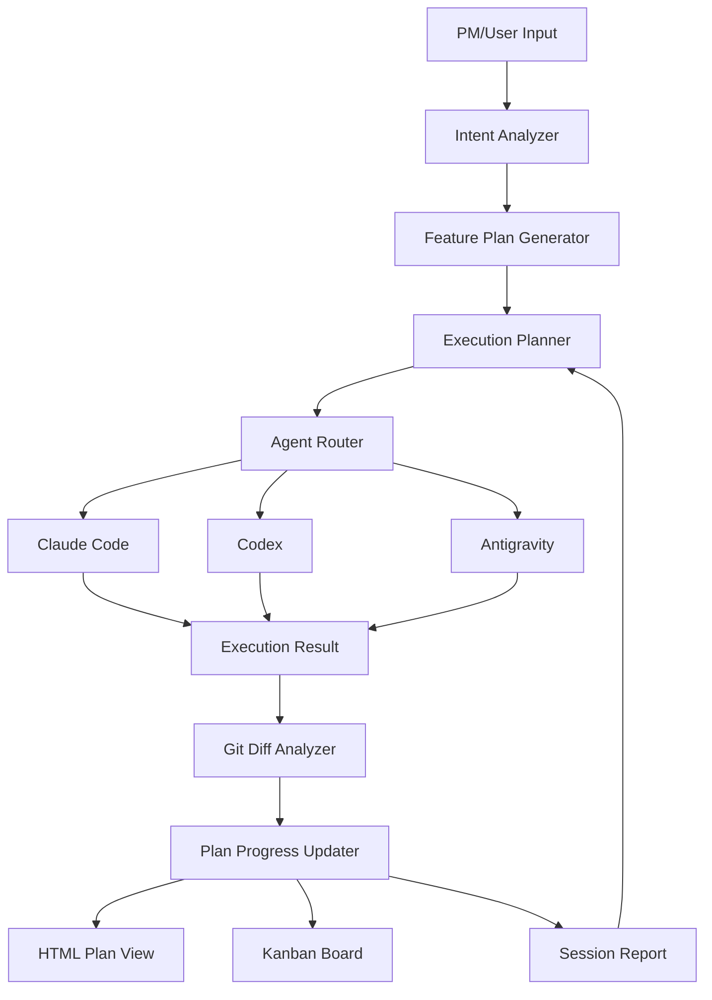

# ARCHITECTURE.md — Agent Control Room

## 1. Architecture Goal
Agent Control Room is a **Human-in-the-loop AI Development Orchestrator**. 
It is not merely a CLI execution wrapper. It is an operational control room where a PM or non-developer inputs a product goal, and the system translates it into a functional plan, delegates tasks to appropriate AI coding agents (Claude Code, Codex, Antigravity), tracks execution, analyzes git diffs, and orchestrates the transition to the next step.

## 2. System Overview
### 2.1 Core Loop
The orchestration follows a continuous iterative loop:
```txt
User Input (Goal)
        ↓
Feature Plan Generator
        ↓
Execution Planner & Agent Router
        ↓
Agent Execution
        ↓
Git Diff & Outcome Analyzer
        ↓
Plan Updater & Next Prompt Generator
```

### 2.2 Target Architecture Layers



| Layer | Responsibility |
|---|---|
| **Intent Analyzer** | Parses user's natural language request to identify goals, constraints, and scope. |
| **Feature Plan Generator** | Breaks down the goal into a structured, functional plan. |
| **Execution Planner** | Organizes task sequence, dependencies, and execution strategy. |
| **Agent Router** | Selects the appropriate execution environment (Claude Code, Codex, Antigravity). |
| **Agent Execution Runner** | Safely executes the agent (e.g. via CLI `spawn`) within an isolated branch. |
| **Git Diff Analyzer** | Inspects `git diff` to understand what the agent actually changed. |
| **Plan Progress Updater** | Marks plan items as done/partial/blocked based on diff analysis. |
| **HTML Plan View** | Presents the live implementation plan to the user. |
| **Kanban Board** | Visualizes agent states and active work cards (Operational UI). |
| **Session Report** | Documents the outcome of a session, generating the next prompt. |

## 3. Core Modules (Implemented & Future)

### 3.1 Project Registry & Reader
Stores projects and reads context from `AGENT_STATE.md`, `TASKS.md`, `HANDOFF.md`, etc.

### 3.2 Technical Translator & Decomposer
Converts product direction into small executable tasks. (Currently mapped to Direction to Prompt & Advisor Mode).

### 3.3 Advisor Mode (T015)
When execution is blocked or ambiguous, this module provides interpretation, options, recommendations, and generates a copy-ready prompt for the next step.

### 3.4 HTML Plan View & Kanban (T017 & Open-source Base)
Visualizes the planned tasks and their real-time statuses. The Kanban board acts as the operational UI displaying agent tracks, while the HTML Plan View acts as the living implementation checklist.

### 3.5 Agent Execution Runner (T018)
The adapter that invokes Claude Code or Codex. It manages:
- Creating safe git worktrees/branches.
- Spawning the CLI process.
- Streaming stdout/stderr logs.
- Capturing the exit code.

### 3.6 Diff & Outcome Analyzer (T019)
Replaces manual session reporting. It reads `git diff --name-only` and `git diff`, sends it to an LLM, and automatically determines which tasks were completed and what files were modified.

## 4. Open-Source Integration (Vibe Kanban)
Agent Control Room sits on top of an open-source base (currently evaluating Vibe Kanban) to handle the operational UI (Kanban board) and potential workspace isolation.
- **Kanban as a Viewer**: It visualizes the plan, but does not dictate the orchestration logic.
- **API Bridge**: Uses a local HTTP API or MCP to sync tasks generated by Agent Control Room into Kanban cards.

## 5. Development Phases

- **Phase 1: Manual Orchestration (Current)**: Direction translation, Advisor Mode, manual copy-paste prompts, and manual session reporting.
- **Phase 2: Structured Planning (Next)**: HTML Plan View, Kanban data model mapping, task breakdown visibility.
- **Phase 3: Semi-Automated Execution**: CLI Runner, branch safety, log capture, Git Diff summary, and outcome analysis.
- **Phase 4: Multi-Agent Routing**: Auto-routing based on agent rate limits, tool strengths, and automatic handoffs.
- **Phase 5: Autonomous Loop**: Self-healing, auto-retry on failure, auto-commit, and seamless looping.

*(For detailed Task and Data Models, see `TASK_MODEL.md` and `ROADMAP.md`)*
