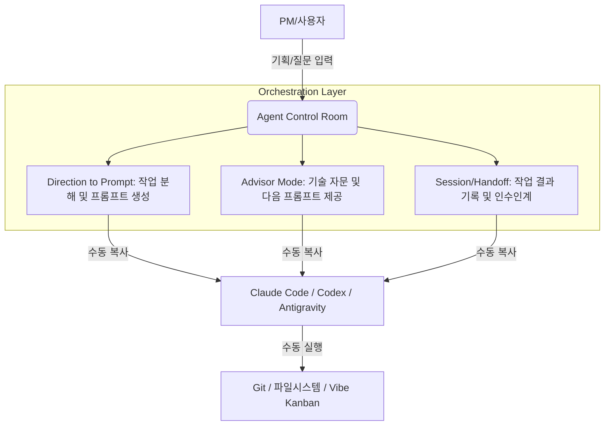
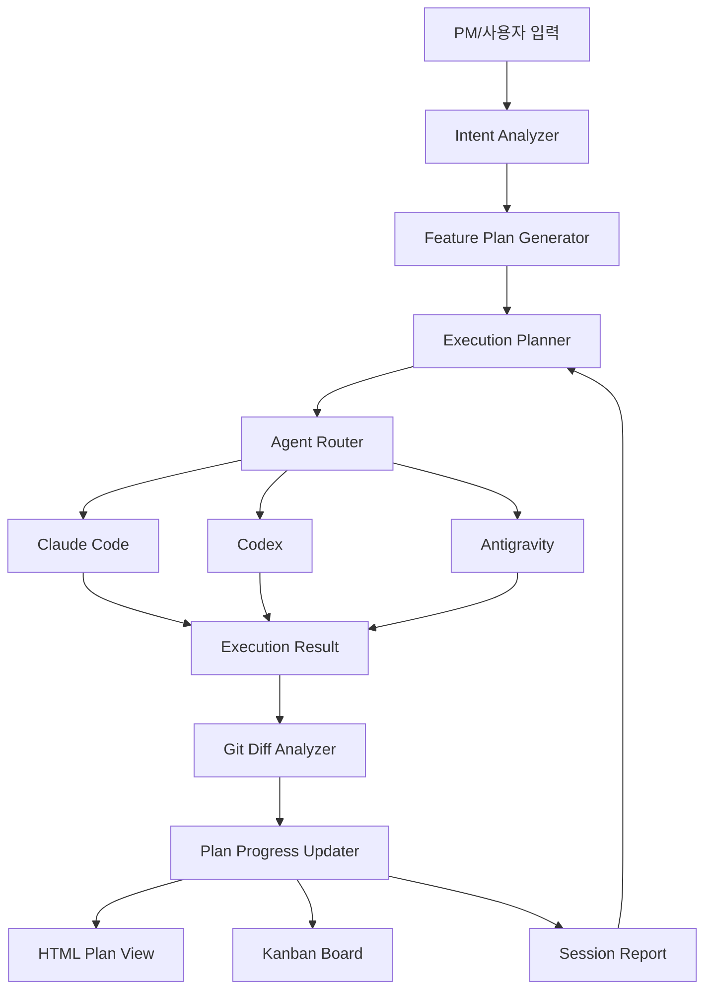

# Agent Control Room 아키텍처 리뷰 및 향후 방향성 정렬

## 문서 목적

이 문서는 PM/비개발자 사용자를 위한 AI 코딩 에이전트 오케스트레이터인 **Agent Control Room**의 현재 구현 방향과 향후 발전 방향을 정렬하기 위해 작성되었다.

핵심 결론은 다음과 같다.

> Agent Control Room은 단순히 Claude Code, Codex, Antigravity를 실행하는 버튼형 도구가 아니라, PM의 의도를 기능 단위 실행계획으로 바꾸고, 적절한 개발 에이전트에게 배정하며, 진행상태·산출물·Git Diff·다음 액션을 관리하는 **AI 개발 오케스트레이션 운영실**이다.

---

## 1. 현재 아키텍처 이해

현재까지 구현된 방향은 자동 실행보다는 **수동 프롬프트 복사 및 핸드오프 중심의 오케스트레이션**에 가깝다.

즉, Phase 1 & 2의 핵심은 다음과 같다.



### 현재 구조의 강점

- PM/비개발자가 직접 복잡한 개발 프롬프트를 설계하지 않아도 된다.
- 사용자의 기획 의도를 개발 가능한 명령어로 변환할 수 있다.
- 에러나 기술적 불확실성이 발생했을 때 Advisor Mode가 해석과 다음 프롬프트를 제공한다.
- 세션/Handoff 기록을 통해 작업 맥락을 이어갈 수 있다.

### 현재 구조의 한계

- 사용자가 매번 프롬프트를 복사/붙여넣기 해야 한다.
- 어떤 에이전트에게 어떤 작업을 맡겼는지 자동 추적이 어렵다.
- 변경된 파일과 작업 결과를 사용자가 직접 확인하고 리포트에 적어야 한다.
- 기능이 완성될 때까지 계획이 자동으로 업데이트되는 구조가 아직 약하다.

---

## 2. 사용자가 원하는 최종 방향

Agent Control Room의 최종 방향은 단순 CLI 실행 자동화가 아니다.

사용자가 원하는 방향은 다음과 같다.

1. 사용자가 자연어로 구현하고 싶은 기능이나 목표를 입력한다.
2. 시스템이 목표를 분석해 기능 단위 계획으로 나눈다.
3. 각 작업에 적합한 개발 환경 또는 에이전트를 선택한다.
4. Claude Code, Codex, Antigravity 등에 전달할 고도화된 프롬프트를 생성한다.
5. 사용자가 확인 후 실행한다.
6. 실행 과정과 상태가 Kanban 또는 HTML Plan View에 표시된다.
7. 작업이 완료되면 Git Diff를 분석해 무엇이 바뀌었는지 요약한다.
8. 구현 계획에서 완료된 항목을 자동 표시한다.
9. 기능이 완성될 때까지 다음 작업과 다음 프롬프트를 계속 생성한다.

즉, 핵심은 다음과 같다.

> 사용자의 목표를 기능 단위로 쪼개고, 각 기능을 어떤 에이전트/환경에 맡길지 결정하고, 실행 결과를 받아 다시 계획을 갱신하면서, 최종 기능 완성까지 추적하는 시스템.

---

## 3. 방향성 일치 여부 판단

현재까지 정리된 방향과 사용자가 원하는 방향은 큰 틀에서 일치한다.

다만 현재 문서와 구현 방향은 아직 **CLI Runner 중심**으로 보일 수 있다. 실제 제품 방향은 CLI Runner보다 상위 개념인 **AI 개발 오케스트레이션 운영실**이어야 한다.

| 사용자 요구 | 현재 방향과의 일치도 | 판단 |
|---|---:|---|
| 프롬프트를 넣으면 적절한 개발 환경을 찾아 실행 | 높음 | CLI Runner와 Agent Router 방향과 맞음 |
| 고도화된 프롬프트로 변환 후 실행 | 높음 | Direction to Prompt와 Advisor Mode와 일치 |
| 기능이 완성될 때까지 오케스트레이션이 계획 생성 | 중간~높음 | 반복 루프 설계 보강 필요 |
| 구현 계획이 HTML로 보임 | 중간 | HTML Plan View 별도 기능 필요 |
| 구현될 때마다 계획 완료 표시 | 중간 | Task State Model 필요 |
| 기능 추가마다 HTML 계획에 반영 | 중간 | Plan Registry 필요 |
| 에이전트 움직임이 Kanban으로 보임 | 높음 | Vibe Kanban 또는 자체 Kanban Layer로 가능 |
| 서브에이전트 움직임도 카드에서 추적 | 중간 | 실제 내부 추적보다 계획 기반 추적이 현실적 |
| 실시간은 아니어도 시작/종료 과정 표시 | 매우 높음 | Phase 3에 적합한 수준 |

---

## 4. Agent Control Room의 핵심 정의

Agent Control Room은 다음과 같이 정의하는 것이 가장 적절하다.

> PM/비개발자가 구현하고 싶은 기능을 입력하면, 시스템이 이를 개발 가능한 작업계획으로 분해하고, 적절한 AI 코딩 에이전트에게 배정하며, 실행 결과를 분석해 다음 작업까지 이어주는 Human-in-the-loop AI Development Orchestrator.

한국어로는 다음과 같이 정의할 수 있다.

> 사람이 승인하고, AI가 실행하며, 시스템이 기록·판정·다음 작업을 이어주는 개발 오케스트레이터.

---

## 5. 추천 최종 아키텍처



### 핵심 레이어

| 레이어 | 역할 |
|---|---|
| Intent Analyzer | 사용자의 자연어 요청에서 목표, 제약, 기능 범위를 분석 |
| Feature Plan Generator | 목표를 기능 단위 계획으로 분해 |
| Execution Planner | 작업 순서, 의존성, 실행 전략을 구성 |
| Agent Router | Claude Code, Codex, Antigravity 등 적절한 실행 환경 선택 |
| Agent Execution Runner | 선택된 에이전트를 실제 실행 |
| Git Diff Analyzer | 변경 파일과 변경 내용을 분석 |
| Plan Progress Updater | 완료/부분완료/실패/보류 상태를 계획에 반영 |
| HTML Plan View | 구현 계획과 진행상태를 사용자가 볼 수 있게 표시 |
| Kanban Board | 작업 카드와 에이전트 상태를 운영 대시보드처럼 표시 |
| Session Report | 작업 결과, 다음 액션, 리스크를 문서화 |

---

## 6. T016 / T017 방향 재정의

현재 T016과 T017은 다음과 같이 이해되고 있다.

- T016: CLI Runner
- T017: Git Diff 자동 요약

하지만 사용자가 원하는 제품 방향 기준으로는 다음과 같이 재정의하는 것이 더 적절하다.

---

## 6.1 T016: Agent Execution Runner

T016은 단순히 CLI를 실행하는 기능이 아니라, 선택된 에이전트에게 작업을 보낼 수 있는 **실행 어댑터**여야 한다.

### 주요 기능

| 기능 | 설명 |
|---|---|
| Agent 선택 | Claude Code / Codex / Antigravity 중 선택 |
| Prompt 전달 | 생성된 고도화 프롬프트 전달 |
| 작업 단위 생성 | 실행 전 Kanban 카드 생성 |
| Git Branch 생성 | 작업 격리 |
| 실행 로그 저장 | stdout/stderr 저장 |
| 실행 상태 관리 | pending / running / done / failed |
| 결과 수집 | 완료 후 변경 파일, 로그, 에러 수집 |

### T016의 본질

> 실행 버튼이 아니라, 에이전트 작업 생성기이다.

---

## 6.2 T017: Diff & Outcome Analyzer

T017은 단순 Git Diff 요약기가 아니라, 실행 결과가 계획 대비 무엇을 완료했는지 판정하는 레이어여야 한다.

### 주요 기능

| 기능 | 설명 |
|---|---|
| 변경 파일 목록 수집 | `git diff --name-only` |
| 코드 변경 요약 | 어떤 기능이 수정됐는지 설명 |
| 계획 항목 매칭 | 어떤 TODO가 완료됐는지 자동 연결 |
| 완료 여부 판정 | done / partial / blocked |
| 다음 액션 생성 | 이어서 실행할 프롬프트 생성 |
| 세션 리포트 생성 | 사람이 리뷰 가능한 결과물 생성 |

### T017의 본질

> Diff 요약기가 아니라, 작업 결과 판정기이다.

---

## 7. 자동 실행 수준에 대한 판단

초기 목표는 완전 무인 자동화가 아니라 **반자동화**가 맞다.

추천 흐름은 다음과 같다.

```text
사용자 목표 입력
→ 시스템이 기능 단위 계획 생성
→ 실행할 프롬프트 생성
→ 사용자가 확인
→ 실행 버튼 클릭
→ 에이전트 실행
→ 로그/결과 확인
→ Git Diff 요약
→ 계획 완료 표시
→ 다음 실행 제안
```

초기에는 사용자가 다음을 직접 통제할 수 있어야 한다.

- 어떤 기능을 만들지
- 어떤 에이전트에게 맡길지
- 실행 전 프롬프트가 적절한지
- 변경사항을 반영할지
- 다음 단계로 넘어갈지

따라서 제품 방향은 다음 표현이 적절하다.

> Human-in-the-loop AI Development Orchestrator

---

## 8. T016 Research Spike 필요성

T016은 바로 UI 버튼부터 구현하기보다, 짧은 Research Spike를 먼저 수행하는 것이 좋다.

이유는 Claude Code, Codex, Antigravity가 각각 CLI 실행 방식, 프롬프트 전달 방식, 종료 방식, 로그 수집 방식이 다를 수 있기 때문이다.
