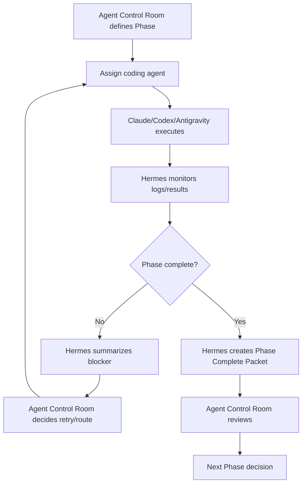
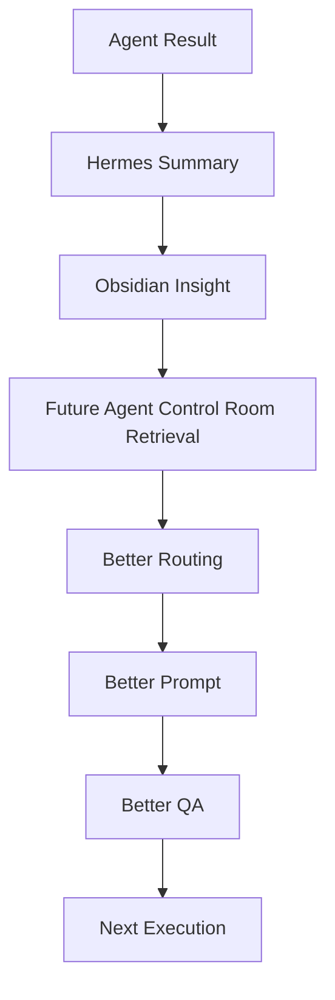

# Hermes + Agent Control Room 운영 기획서

## 0. 문서 목적

이 문서는 Agent Control Room 안에서 Hermes를 어떻게 적극적으로 활용할지 정의한다.

기존 방향은 Hermes를 단순한 백그라운드 요약자, 실패 로그 분석자, Obsidian 기록자로 제한하는 것이었다.
하지만 현재 방향은 한 단계 더 적극적이다.

Hermes는 Agent Control Room의 보조 워커이지만, 단순 관찰자만은 아니다.
Hermes는 터미널, Git, 배포, 자동화 기능을 사용할 수 있다.
다만 코딩 에이전트와 충돌하지 않도록 역할 경계를 명확히 나누고, 위험 작업은 텔레그램을 통해 사용자에게 승인 또는 판단을 요청해야 한다.

핵심 구조는 다음과 같다.

> Agent Control Room은 전체 계획, Phase 관리, 에이전트 배정, 최종 판단을 담당한다.  
> Hermes는 자잘한 운영 작업, 로그 분석, 자동화, 상태 보고, 승인 요청, 결과 회수, 다음 루프 패킷 생성을 담당한다.  
> Claude Code / Codex / Antigravity는 Agent Control Room이 정의한 Phase가 완료될 때까지 코딩/QA/UI 작업을 수행한다.  
> Phase가 완료되면 Hermes가 결과를 수집해 Agent Control Room으로 되돌리고, Agent Control Room이 다음 작업을 판단한다.

---

## 1. 전체 시스템 정의

Agent Control Room은 비개발자 PM을 위한 AI 개발 관제실이다.

사용자는 직접 코드를 세밀하게 작성하거나 각 코딩 에이전트의 작업을 하나하나 통제하지 않는다.
대신 Agent Control Room이 다음을 판단한다.

- 지금 무엇을 해야 하는지
- 어떤 Phase가 진행 중인지
- 어떤 Phase가 완료되었는지
- 누구에게 작업을 맡길지
- 병렬 작업이 가능한지
- 어떤 작업이 위험한지
- 어떤 파일을 건드려도 되는지
- 어떤 파일은 절대 건드리면 안 되는지
- 실패가 발생했을 때 어떤 루프로 되돌릴지
- 사용자 승인이 필요한지
- 다음 작업을 어떤 에이전트에게 넘길지

Hermes는 이 구조 안에서 Agent Control Room의 백그라운드 운영 워커로 작동한다.

---

## 2. 역할 분담

### 2.1 Agent Control Room

Agent Control Room은 최종 판단자다.

담당 역할:

- 전체 로드맵 관리
- Phase 정의
- Phase 완료 기준 정의
- 작업 우선순위 결정
- 에이전트 배정
- 병렬 작업 가능 여부 판단
- 위험도 판단
- 승인 게이트 관리
- 프롬프트 컴파일
- 코딩 에이전트 작업 지시
- Hermes가 보낸 결과를 바탕으로 다음 루프 결정

Agent Control Room은 항상 최종 판단 권한을 가진다.

Hermes가 다음 작업을 제안할 수는 있지만, 최종 결정은 Agent Control Room이 한다.

---

### 2.2 Hermes

Hermes는 Agent Control Room의 실행 보조 및 운영 워커다.

Hermes는 단순 요약자만이 아니다.
Hermes는 다음 작업을 수행할 수 있다.

- 터미널 실행
- Git 작업
- 배포 작업
- 자동화 작업
- 로그 분석
- 실패 로그 정리
- 코딩 에이전트 결과 요약
- Phase 완료 상태 수집
- Agent Control Room에 결과 전달
- Obsidian 인사이트 저장
- Context Pack 생성
- Handoff Pack 생성
- Orchestration Packet 생성
- 텔레그램 상태 보고
- 텔레그램 승인 요청
- 자잘한 운영 질문에 대한 응답
- 반복 작업 자동화
- 스케줄 기반 점검

단, Hermes는 코딩 에이전트의 역할을 침범하지 않는다.

Hermes가 할 수 있는 실행 작업은 운영/자동화/상태 확인/배포/보고 중심이다.
코드 작성, 복잡한 리팩토링, 기능 구현은 Claude Code / Codex / Antigravity가 담당한다.

---

### 2.3 Claude Code

Claude Code는 복잡한 개발 작업을 담당한다.

적합한 작업:

- 아키텍처 설계
- 통합 구현
- 복잡한 리팩토링
- 코드 구조 판단
- 핵심 기능 구현
- Phase 단위 개발
- 기존 코드와 새 기능 연결

---

### 2.4 Codex

Codex는 QA, 테스트, 오류 검증, 작은 수정에 적합하다.

적합한 작업:

- 테스트 작성
- 타입 오류 검증
- 린트 오류 검증
- 회귀 테스트
- 기능 점검
- 작은 범위의 isolated fix
- Claude Code 결과 QA

---

### 2.5 Antigravity

Antigravity는 UI와 화면 단위 개선에 적합하다.

적합한 작업:

- 화면 구성
- UI 컴포넌트 개선
- 반응형 디자인
- 시각적 QA
- UX 개선
- 프론트엔드 화면 단위 polish

---

## 3. Hermes의 핵심 운영 원칙

### 3.1 Hermes는 Agent Control Room으로 되돌린다

Hermes는 작업 결과를 단독으로 종결하지 않는다.

올바른 흐름:

1. Agent Control Room이 Phase와 작업 방향을 정의한다.
2. Claude Code / Codex / Antigravity가 Phase 작업을 수행한다.
3. Hermes가 작업 결과, 로그, 실패 여부, 변경 파일, QA 결과를 수집한다.
4. Hermes가 결과를 구조화한다.
5. Hermes가 Agent Control Room에 Orchestration Packet을 반환한다.
6. Agent Control Room이 다음 Phase 또는 재시도 루프를 판단한다.

핵심 문장:

> Hermes는 루프를 끝내는 최종 판단자가 아니라, 루프가 다시 잘 돌도록 Agent Control Room에 되돌려주는 운영 워커다.

---

### 3.2 Hermes는 자잘한 운영 판단을 처리할 수 있다

Hermes는 모든 것을 Agent Control Room에 되돌릴 필요는 없다.

낮은 위험도의 자잘한 작업은 Hermes가 직접 처리할 수 있다.

예시:

- 현재 브랜치 확인
- 작업 로그 정리
- 테스트 결과 요약
- 빌드 로그 요약
- 배포 상태 확인
- Git status 확인
- 최근 커밋 확인
- 에이전트별 작업 결과 비교
- 텔레그램으로 상태 보고
- Obsidian 노트 생성
- Handoff Pack 생성
- 단순 명령 실행 결과 요약

다만 코드 변경, 보안 변경, 의존성 변경, 데이터 삭제, 배포, 브랜치 병합 등은 사용자 승인 또는 Agent Control Room 판단이 필요하다.

---

## 4. Hermes에게 허용할 기능

### 4.1 터미널 사용 허용

Hermes에게 terminal 기능은 켜준다.

허용 목적:

- 상태 확인
- 로그 확인
- 테스트 실행
- 빌드 실행
- Git 상태 확인
- 배포 명령 실행
- 자동화 스크립트 실행
- 코딩 에이전트 작업 결과 검증

허용 예시:

```bash
git status
pnpm test
pnpm lint
pnpm typecheck
pnpm build
git log --oneline -n 10
vercel --version
```

주의:

Hermes가 terminal을 사용할 수 있다고 해서 모든 명령을 자유롭게 실행하는 것은 아니다.
명령은 위험도에 따라 자동 실행, 승인 필요, 금지로 나뉜다.

---

### 4.2 Git 작업 허용

Hermes에게 Git 작업을 허용한다.

허용되는 Git 작업:

- `git status`
- `git diff`
- `git log`
- `git branch`
- `git checkout` 단, 안전 브랜치 기준 필요
- `git add`
- `git commit`
- `git stash`
- `git tag` 단, 승인 필요 가능

주의가 필요한 Git 작업:

- `git push`
- `git merge`
- `git rebase`
- `git reset`
- `git clean`
- 원격 브랜치 삭제
- force push

원칙:

- 상태 확인성 Git 명령은 Hermes가 직접 수행 가능하다.
- 기록 생성성 Git 명령은 상황에 따라 가능하다.
- 히스토리 변경성 Git 명령은 사용자 승인 필요다.
- 원격 반영성 Git 명령은 텔레그램 승인 필요다.

---

### 4.3 배포 작업 허용

Hermes에게 배포 작업도 허용한다.

다만 배포는 기본적으로 사용자 승인 또는 Agent Control Room 판단 후 실행한다.

허용되는 배포 관련 작업:

- 배포 상태 확인
- preview deployment 생성
- build 로그 확인
- deployment URL 수집
- 배포 결과 요약
- 텔레그램으로 배포 상태 보고

승인이 필요한 작업:

- production deployment
- rollback
- 환경변수 변경
- DNS 관련 변경
- DB와 연결된 배포
- 사용자가 직접 보는 서비스에 영향을 주는 배포

---

### 4.4 자동화 기능 허용

Hermes에게 자동화 기능을 허용한다.

적합한 자동화:

- 주기적 작업 로그 요약
- 매일 진행 상황 요약
- 실패 로그 감지
- 테스트 결과 수집
- 빌드 결과 수집
- Phase 완료 여부 점검
- 텔레그램 알림
- Obsidian Daily Note 생성
- 반복 실패 패턴 정리
- 다음 작업 후보 정리

자동화 금지 또는 승인 필요:

- 자동 코드 수정
- 자동 의존성 설치
- 자동 DB migration
- 자동 production deploy
- 자동 git push
- 자동 merge
- 자동 보안 설정 변경
- 자동 승인 우회

---

## 5. Hermes의 금지 또는 제한 작업

Hermes는 terminal, Git, 배포, 자동화 기능을 사용할 수 있지만 아래 작업은 제한한다.

### 5.1 기본 금지

Hermes가 기본적으로 하면 안 되는 작업:

- 복잡한 기능 구현
- 대규모 리팩토링
- 코딩 에이전트가 진행 중인 파일 직접 수정
- runner/spawn 로직 임의 수정
- approval-token-store 임의 수정
- 인증/auth/security 로직 임의 수정
- DB schema 임의 변경
- migration 임의 실행
- package.json 임의 변경
- dependency 임의 설치
- force push
- destructive reset
- 사용자 승인 없는 production deploy

---

### 5.2 텔레그램 승인 필요 작업

아래 작업은 Hermes가 직접 진행하기 전에 텔레그램으로 사용자에게 물어봐야 한다.

- production 배포
- git push
- git merge
- git rebase
- package dependency 변경
- DB migration
- 환경변수 변경
- 인증/보안 관련 변경
- runner/spawn/approval 로직 변경
- 대량 파일 삭제
- public 서비스에 영향 있는 작업
- 실패 후 자동 재시도 범위를 넘어서는 작업

텔레그램 메시지 형식:

```md
[Hermes Approval Request]

작업: production deploy
위험도: high
이유: 실제 사용자에게 반영되는 배포입니다.
현재 상태:
- typecheck: pass
- lint: pass
- build: pass
- tests: pass

영향 범위:
- app/plan/page.tsx
- components/roadmap/*

추천:
승인 가능하지만, 배포 전 preview URL 확인을 권장합니다.

응답 옵션:
1. approve
2. reject
3. preview first
4. send back to Agent Control Room
```

---

## 6. 텔레그램 연동 정책

Discord가 아니라 Telegram을 사용한다.

Hermes는 Telegram을 통해 사용자에게 상태 보고, 승인 요청, 차단 상황, 완료 알림을 보낸다.

### 6.1 Telegram을 사용하는 경우

Hermes는 다음 상황에서 Telegram으로 알린다.

- 사용자 승인이 필요한 작업
- 위험도가 높은 작업
- Phase 완료
- Phase 실패
- 코딩 에이전트 작업 충돌 가능성
- 배포 전 확인 필요
- 테스트/빌드 실패
- 반복 실패 발생
- Agent Control Room의 다음 판단이 필요한 경우
- Hermes가 자율 처리 가능한 낮은 위험 작업을 완료한 경우

---

### 6.2 Telegram 메시지 유형

#### 1. Status Report

```md
[Hermes Status Report]

현재 Phase: Phase 14 - Execution Loop Integration
상태: Claude Code 작업 진행 중
최근 결과: Codex QA 대기
위험도: medium
다음 추천: Codex에게 typecheck/lint QA만 수행시키기
Agent Control Room 회수 필요: 아직 아님
```

#### 2. Approval Request

```md
[Hermes Approval Request]

작업: git push origin feature/hermes-worker
위험도: high
이유: 원격 저장소에 변경사항이 반영됩니다.
검증 상태:
- typecheck: pass
- lint: pass
- build: pass

승인하려면 approve라고 답변하세요.
거절하려면 reject라고 답변하세요.
Agent Control Room으로 되돌리려면 control-room이라고 답변하세요.
```

#### 3. Phase Complete Report

```md
[Hermes Phase Complete]

완료 Phase: Phase 15 - Hermes Background Worker Policy
담당 에이전트: Claude Code
결과: 완료
검증:
- 문서 업데이트 완료
- Hermes 정책 추가 완료
- Toolset boundary 추가 완료

Agent Control Room으로 결과를 반환합니다.
```

#### 4. Failure Report

```md
[Hermes Failure Report]

실패 작업: pnpm build
실패 원인 추정: RoadmapTimeline props mismatch
영향 파일:
- components/roadmap/RoadmapTimeline.tsx
- lib/roadmap-ui-adapter.ts

추천 다음 작업:
Codex에게 isolated type fix QA 요청

Agent Control Room으로 Orchestration Packet 반환 필요: yes
```

---

## 7. Phase 기반 운영 루프

### 7.1 기본 루프

Agent Control Room은 전체 계획과 Phase를 정의한다.

각 Phase는 다음 정보를 가진다.

- phase_id
- phase_title
- goal
- owner_agent
- allowed_files
- do_not_touch_files
- acceptance_criteria
- QA_scope
- risk_level
- user_approval_required
- completion_signal

Hermes는 각 Phase 진행 상황을 모니터링한다.

---

### 7.2 Phase 실행 루프



---

### 7.3 Phase 완료 시 Hermes가 하는 일

Phase가 완료되면 Hermes는 다음을 수행한다.

1. 작업 결과 수집
2. 변경 파일 정리
3. 테스트/빌드/QA 결과 정리
4. 실패 또는 경고 사항 정리
5. Obsidian 인사이트 생성
6. Agent Control Room으로 Phase Complete Packet 반환
7. Telegram으로 완료 요약 전송
8. 다음 Phase 준비에 필요한 Context Pack 생성

---

## 8. Orchestration Packet

Hermes는 Agent Control Room에 다음 구조로 결과를 반환한다.

```json
{
  "packet_type": "orchestration_packet",
  "source": "hermes",
  "phase_id": "phase-15",
  "phase_title": "Hermes Background Worker Policy",
  "status": "completed | failed | blocked | needs_approval",
  "source_agent": "Claude Code",
  "task_summary": "Updated Hermes policy documentation",
  "result_summary": "Documentation now defines Hermes as an approval-based execution worker with Telegram reporting.",
  "changed_files": [
    "docs/HERMES_BACKGROUND_WORKER.md",
    "docs/HERMES_TOOLSET_POLICY.md"
  ],
  "affected_files": [],
  "failure_summary": null,
  "suspected_cause": null,
  "risk_level": "medium",
  "conflict_risk": "low",
  "suggested_next_agent_type": "Codex",
  "suggested_next_action": "Run policy QA and verify Hermes is not positioned as a coding agent.",
  "do_not_touch_files": [
    "runner/",
    "lib/approval-token-store.ts",
    "package.json"
  ],
  "required_context": [
    "Hermes role policy",
    "Telegram approval workflow",
    "Phase completion criteria"
  ],
  "suggested_prompt": "Review Hermes policy docs for safety boundaries and routing clarity.",
  "user_approval_needed": false,
  "telegram_notification_needed": true,
  "obsidian_note_path": "AgentControlRoom/Phases/phase-15-hermes-policy.md"
}
```

---

## 9. Gemini API 기반 운영

Hermes는 우선 Gemini API 기반으로 움직인다.

초기 기준:

- Gemini API를 기본 모델 공급자로 사용
- Hermes의 요약/분석/패킷 생성/텔레그램 응답에 사용
- 호출량, 비용, 안정성을 관찰
- 호출량이 과도하거나 응답 품질이 부족하면 OpenAI API로 전환 가능

### 9.1 Gemini API에 적합한 Hermes 작업

- 로그 요약
- 상태 보고
- 실패 원인 정리
- Handoff Pack 생성
- Context Pack 생성
- Obsidian 노트 작성
- Telegram 응답 생성
- Phase 완료 보고서 생성
- 반복 실패 패턴 추출

### 9.2 OpenAI API 전환 기준

OpenAI API로 전환을 고려하는 경우:

- Gemini 호출량이 예상보다 많아 비용/속도 문제가 생김
- 긴 로그 분석 품질이 부족함
- 구조화 JSON 출력 안정성이 낮음
- 복잡한 오케스트레이션 판단이 자주 필요함
- Telegram 응답에서 승인/위험도 구분이 불안정함

### 9.3 모델 운영 원칙

Hermes의 모델은 최종 판단자가 아니다.

Gemini API 또는 OpenAI API는 Hermes의 판단 보조 엔진이다.
최종 작업 라우팅과 위험 작업 결정은 Agent Control Room 정책을 따른다.

---

## 10. Obsidian Memory Loop

Hermes는 Obsidian을 단순 기록소가 아니라 운영 메모리로 사용한다.

### 10.1 저장 대상

Hermes가 Obsidian에 저장할 내용:

- Phase별 작업 결과
- 에이전트별 성공/실패 패턴
- 반복 실패 원인
- 프롬프트 성공 패턴
- 파일 충돌 패턴
- 안전 정책 위반 가능성
- 테스트/빌드 실패 이력
- 배포 이력
- Telegram 승인 이력
- Agent Control Room 판단에 도움 되는 인사이트

---

### 10.2 추천 Obsidian 폴더 구조

```txt
AgentControlRoom/
  Daily/
    2026-05-22.md
  Phases/
    phase-001.md
    phase-002.md
  OrchestrationPackets/
    2026-05-22-001.md
  AgentPerformance/
    claude-code.md
    codex.md
    antigravity.md
    hermes.md
  FailurePatterns/
    build-failures.md
    typecheck-failures.md
    file-conflicts.md
    deployment-failures.md
  PromptPatterns/
    successful-prompts.md
    failed-prompts.md
  TelegramApprovals/
    2026-05-22-production-deploy.md
  Handoffs/
    latest-handoff.md
```

---

### 10.3 개선 루프



핵심:

> Hermes가 기록한 인사이트는 다음 오케스트레이션의 품질을 높이기 위해 재사용되어야 한다.

---

## 11. Hermes Skills 설계

Hermes에는 Agent Control Room 전용 스킬을 둔다.

추천 스킬:

```txt
~/.hermes/skills/agent-control-room/
  failure-log-analyzer/SKILL.md
  orchestration-packet-writer/SKILL.md
  phase-completion-reporter/SKILL.md
  obsidian-insight-writer/SKILL.md
  telegram-approval-requester/SKILL.md
  deployment-status-reporter/SKILL.md
  git-operation-guard/SKILL.md
  agent-result-summarizer/SKILL.md
```

---

### 11.1 failure-log-analyzer

목적:

- 실패 로그 분석
- 원인 추정
- 영향 파일 정리
- 다음 루프 후보 제안

금지:

- 직접 코드 수정
- 자동 재시도
- 위험 작업 승인

---

### 11.2 orchestration-packet-writer

목적:

- Agent Control Room에 반환할 구조화 패킷 생성
- 다음 작업자를 제안
- 필요한 컨텍스트 정리

주의:

- Hermes는 제안만 한다.
- 최종 판단은 Agent Control Room이 한다.

---

### 11.3 telegram-approval-requester

목적:

- 위험 작업 전 사용자에게 Telegram으로 승인 요청
- 응답을 해석해 Hermes 또는 Agent Control Room으로 전달

응답 옵션:

- approve
- reject
- preview first
- control-room
- explain

---

### 11.4 git-operation-guard

목적:

- Git 작업의 위험도 분류
- 안전 명령과 위험 명령 구분
- push/merge/rebase/reset 등 승인 필요 작업 감지

---

### 11.5 deployment-status-reporter

목적:

- 배포 상태 확인
- preview URL 수집
- build 결과 정리
- production deploy 전 승인 요청

---

## 12. Hermes 명령 위험도 분류

### 12.1 Low Risk

Hermes가 자동 실행 가능하다.

```bash
git status
git diff --stat
git log --oneline -n 10
pnpm lint
pnpm typecheck
pnpm test
pnpm build
```

조건:

- 파일을 변경하지 않음
- 외부 서비스에 반영하지 않음
- 히스토리를 바꾸지 않음
- DB에 영향을 주지 않음

---

### 12.2 Medium Risk

Hermes가 실행 가능하지만 상황에 따라 Telegram 보고 또는 Agent Control Room 반환이 필요하다.

```bash
git add
git commit
git stash
git checkout feature/*
vercel deploy --prebuilt
```

조건:

- 로컬 기록 생성 가능
- preview 배포 가능
- 사용자에게 요약 보고 필요

---

### 12.3 High Risk

Telegram 승인 필요.

```bash
git push
git merge
git rebase
git reset --hard
git clean -fd
pnpm add
pnpm remove
vercel --prod
prisma migrate deploy
```

조건:

- 원격 저장소 반영
- production 반영
- 데이터베이스 영향
- 의존성 변경
- 히스토리 변경
- 되돌리기 어려운 작업

---

## 13. 구현해야 할 문서

Claude Code 또는 Agent Control Room 개발 작업에서 다음 문서를 생성/수정한다.

```txt
docs/HERMES_BACKGROUND_WORKER.md
docs/HERMES_TERMINAL_POLICY.md
docs/HERMES_GIT_POLICY.md
docs/HERMES_DEPLOYMENT_POLICY.md
docs/HERMES_AUTOMATION_POLICY.md
docs/HERMES_TELEGRAM_APPROVAL.md
docs/HERMES_OBSIDIAN_MEMORY_LOOP.md
docs/HERMES_SKILLS.md
docs/HERMES_MODEL_PROVIDER.md
docs/ORCHESTRATION_PACKET.md
docs/PHASE_COMPLETION_PACKET.md
docs/AGENT_SCHEDULING_POLICY.md
docs/ARCHITECTURE.md
docs/ROADMAP.md
docs/AGENT_STATE.md
docs/HANDOFF.md
docs/PROMPT_TEMPLATES.md
CLAUDE.md
AGENTS.md
```

중복 문서가 이미 있다면 새로 만들지 말고 기존 문서를 업데이트한다.

---

## 14. Claude Code에게 전달할 프롬프트

```md
# Task: Update Hermes Plan for Agent Control Room as Approval-Based Execution Worker

## Context
Agent Control Room is an AI Development Control Tower for a non-developer PM.

Hermes will be integrated more actively than a passive summarizer.
Hermes may use terminal, Git, deployment, and automation features.
However, Hermes must operate as an approval-based background worker and must return major decisions to Agent Control Room.

Discord is not used.
Telegram is used for user notification and approval.

Hermes will initially run on Gemini API.
If usage or quality becomes an issue, the model provider may switch to OpenAI API.

## Core System Rule
Agent Control Room is the final planning, routing, phase-management, and approval authority.
Hermes supports the loop by running operational tasks, collecting results, analyzing logs, reporting to Telegram, creating packets, and returning outcomes to Agent Control Room.

## Hermes Role
Hermes can:
- use terminal
- run safe validation commands
- inspect Git state
- perform controlled Git operations
- run deployment-related commands
- run automation jobs
- summarize logs
- analyze failures
- create Orchestration Packets
- create Phase Completion Packets
- create Context Packs
- create Handoff Packs
- write Obsidian-compatible notes
- send Telegram status reports
- request Telegram approval for risky actions

Hermes must not replace Claude Code, Codex, or Antigravity as the primary coding agents.

## Agent Roles
Claude Code:
- architecture
- integration implementation
- complex refactor
- core feature development

Codex:
- QA
- tests
- typecheck/lint validation
- regression checks
- isolated fixes

Antigravity:
- UI
- screen-level improvements
- responsive design
- visual QA

Hermes:
- operational execution
- logs
- automation
- Git/deployment support
- Telegram approval
- Obsidian memory
- packet generation
- return-to-Control-Room loop

## Important Principle
Hermes -> Agent Control Room must be the default loop for major decisions.

Hermes may handle small operational tasks directly, but Phase-level decisions, routing, risky operations, and next-step planning must be returned to Agent Control Room.

## Telegram Policy
Replace all Discord references with Telegram.

Hermes should use Telegram for:
- approval requests
- status reports
- phase completion reports
- failure reports
- deployment reports
- blocked loop alerts
- user decision prompts

## Terminal Policy
Enable terminal for Hermes.

Low-risk commands can run automatically:
- git status
- git diff --stat
- git log --oneline -n 10
- pnpm lint
- pnpm typecheck
- pnpm test
- pnpm build

High-risk commands require Telegram approval:
- git push
- git merge
- git rebase
- git reset --hard
- git clean -fd
- dependency changes
- DB migrations
- production deployment
- environment variable changes

## Git Policy
Hermes may use Git.

Read-only Git operations are allowed.
Local commit/stash operations may be allowed if the task is clear and low-risk.
Remote or history-changing operations require Telegram approval.

## Deployment Policy
Hermes may run deployment workflows.
Preview deployment can be automated if safe.
Production deployment requires Telegram approval.
Rollback requires Telegram approval.
Environment variable changes require Telegram approval.

## Automation Policy
Hermes may automate:
- periodic log summaries
- phase status checks
- test/build result summaries
- Obsidian daily notes
- Telegram status reports
- repeated failure pattern extraction
- handoff generation

Hermes must not automate:
- uncontrolled code modification
- dependency changes
- DB migrations
- production deployment without approval
- git push/merge without approval
- approval bypass

## Model Provider Policy
Hermes initially uses Gemini API.

Document fallback criteria for OpenAI API:
- high call volume
- unstable JSON output
- weak long-log analysis
- poor risk classification
- slow or unreliable Telegram response generation

## Required Documentation Updates
Create or update:
- docs/HERMES_BACKGROUND_WORKER.md
- docs/HERMES_TERMINAL_POLICY.md
- docs/HERMES_GIT_POLICY.md
- docs/HERMES_DEPLOYMENT_POLICY.md
- docs/HERMES_AUTOMATION_POLICY.md
- docs/HERMES_TELEGRAM_APPROVAL.md
- docs/HERMES_OBSIDIAN_MEMORY_LOOP.md
- docs/HERMES_SKILLS.md
- docs/HERMES_MODEL_PROVIDER.md
- docs/ORCHESTRATION_PACKET.md
- docs/PHASE_COMPLETION_PACKET.md
- docs/AGENT_SCHEDULING_POLICY.md
- docs/ARCHITECTURE.md
- docs/ROADMAP.md
- docs/AGENT_STATE.md
- docs/HANDOFF.md
- docs/PROMPT_TEMPLATES.md
- CLAUDE.md
- AGENTS.md

If similar documents already exist, update instead of duplicating.

## Acceptance Criteria
- Discord is fully replaced with Telegram.
- Hermes terminal usage is explicitly allowed.
- Hermes Git usage is explicitly allowed with risk boundaries.
- Hermes deployment automation is explicitly allowed with approval boundaries.
- Hermes automation role is defined.
- Gemini API is documented as the initial model provider.
- OpenAI API is documented as fallback.
- Hermes returns major results to Agent Control Room.
- Agent Control Room remains final planner and decision-maker.
- Claude Code, Codex, and Antigravity remain the main coding/QA/UI agents.
- High-risk operations require Telegram approval.
- Phase completion triggers Hermes summary and return packet to Agent Control Room.

## Final Output
Return:
1. Files changed
2. Updated Hermes role summary
3. Telegram approval flow summary
4. Terminal/Git/deployment policy summary
5. Automation policy summary
6. Gemini/OpenAI model provider policy
7. Phase completion loop summary
8. Remaining implementation steps
9. Recommended QA scope
```

---

## 15. Codex QA 프롬프트

```md
# Task: QA Updated Hermes Execution Worker Policy

## Context
Claude Code updated the Agent Control Room documentation.
Hermes is now defined as an approval-based execution and operations worker.
Hermes may use terminal, Git, deployment, and automation features.
Telegram is used instead of Discord.
Gemini API is the initial model provider, with OpenAI API as fallback.

## Goal
Verify that the updated documentation is safe, consistent, and aligned with the intended architecture.

## Checkpoints
Confirm that:
1. All Discord references were replaced with Telegram.
2. Hermes terminal usage is allowed but risk-classified.
3. Hermes Git usage is allowed but push/merge/rebase/reset require Telegram approval.
4. Hermes deployment automation is allowed but production deploy and rollback require Telegram approval.
5. Hermes automation is limited to operational tasks unless approved.
6. Hermes does not replace Claude Code, Codex, or Antigravity as the main coding agents.
7. Agent Control Room remains the final planning and routing authority.
8. Hermes returns Phase results to Agent Control Room.
9. Gemini API is documented as initial provider.
10. OpenAI API fallback criteria are documented.
11. High-risk operations have explicit approval boundaries.
12. Orchestration Packet and Phase Completion Packet are clearly defined.
13. Obsidian memory is used to improve future routing and prompt generation.

## Output
Return:
- Pass/Fail
- Risk findings
- Ambiguous wording
- Missing approval boundaries
- Conflicting role definitions
- Suggested edits
- Final recommendation
```

---

## 16. 최종 판단

현재 방향은 다음과 같이 정리된다.

Hermes는 더 이상 단순 요약자가 아니다.
Hermes는 Agent Control Room의 백그라운드 운영 워커다.

Hermes는 terminal, Git, 배포, 자동화 기능을 사용할 수 있다.
하지만 최종 계획과 Phase 판단은 Agent Control Room이 담당한다.

Hermes는 작은 운영 작업은 직접 처리하고, 중요한 작업은 Telegram으로 사용자에게 묻거나 Agent Control Room으로 되돌린다.

핵심 문장:

> Hermes는 코딩 에이전트를 대체하는 손이 아니라, 코딩 에이전트들이 Phase를 끝낼 때까지 운영하고, 감시하고, 기록하고, 승인받고, 결과를 Agent Control Room에 되돌리는 실행형 운영 지능이다.

