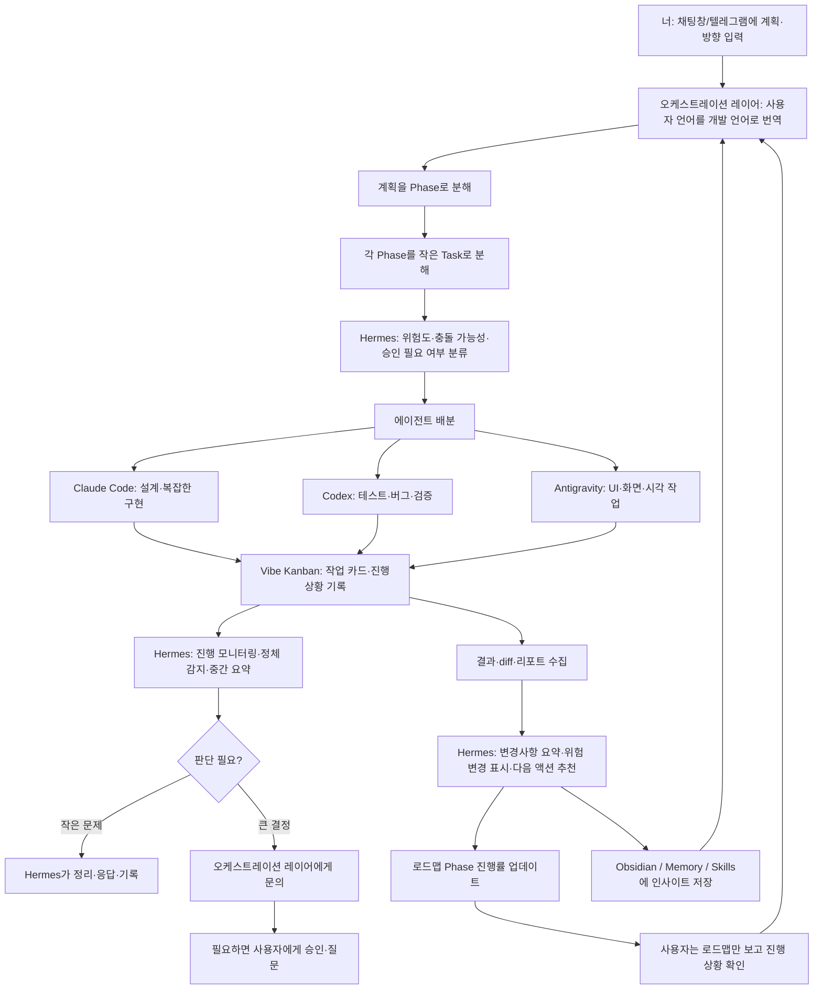

# Agent Control Room — Hermes & Orchestration Layer Architecture

## 1. 문서 목적

이 문서는 Agent Control Room 안에서 **오케스트레이션 레이어**와 **Hermes Agent**의 역할을 명확히 분리하고, 두 레이어가 어떻게 협업해야 하는지 정의한다.

사용자는 비개발자이기 때문에, 사용자의 자연어 방향성을 곧바로 코드 작업으로 넘기면 안 된다. 중간에 반드시 사용자의 의도를 개발 가능한 언어로 번역하고, 작업을 Phase와 Task로 나누고, 각 에이전트에게 안전하게 배분하는 레이어가 필요하다.

따라서 Agent Control Room의 핵심은 단순 자동 실행이 아니라 다음 구조다.

> 사용자 방향성 → 오케스트레이션 레이어 → 작업 분해 → 에이전트 배분 → 실행 감시 → 결과 요약 → 로드맵 업데이트 → 학습 반영

Hermes는 이 구조 안에서 핵심 코딩 에이전트가 아니라, **작업 감시자 / 위험 분류자 / 기록자 / 알림자 / 반복 운영 관리자**로 사용한다.

---

## 2. 전체 방향성

Agent Control Room은 Claude Code, Codex, Antigravity, Hermes, Vibe Kanban을 하나의 개발 운영 시스템처럼 묶는 도구다.

사용자는 개발자가 아니기 때문에 다음을 직접 하지 않는다.

- 기술 설계 세분화
- 파일 단위 작업 분배
- 충돌 위험 판단
- QA 우선순위 판단
- Git diff 해석
- 빌드 로그 해석
- 여러 AI 에이전트의 작업 결과 비교

대신 사용자는 방향을 말한다.

예:

```md
이번 프로젝트는 내가 비개발자여도 Claude, Codex, Antigravity를 병렬로 쓰면서 개발을 진행할 수 있는 컨트롤 타워가 되어야 해.
진행 상황은 로드맵처럼 보여야 하고, 위험한 결정은 나에게 물어봐야 해.
작은 문제는 시스템이 알아서 정리하고 넘어가면 좋겠어.
```

이 자연어 방향성을 실제 개발 가능한 형태로 바꾸는 것이 **오케스트레이션 레이어**의 역할이다.

---

## 3. 핵심 역할 구분

| 구성 요소 | 핵심 역할 | 직접 코드 구현 여부 |
|---|---|---|
| 사용자 | 방향성, 우선순위, 승인 판단 | 하지 않음 |
| Agent Control Room | 전체 오케스트레이션, Phase 관리, 판단 구조 | 제한적 |
| Orchestration Layer | 사용자 언어를 개발 언어로 번역, 작업 분해, 에이전트 배분 | 직접 구현보다 지시 중심 |
| Claude Code | 설계, 복잡한 구현, 핵심 로직 개발 | 가능 |
| Codex | 테스트, 버그 검증, 리팩터링 검토, QA | 가능하되 범위 제한 |
| Antigravity | UI, 화면, 시각적 구현, 프론트엔드 보조 | 가능 |
| Vibe Kanban | 작업 카드, 진행 상태, 기록 보드 | 구현하지 않음 |
| Hermes | 감시, 위험 분류, 요약, 알림, 인사이트 기록 | 핵심 코드 구현 금지 |
| Obsidian / Memory / Skills | 반복 인사이트와 운영 규칙 저장 | 구현하지 않음 |

---

## 4. 오케스트레이션 레이어가 필요한 이유

오케스트레이션 레이어는 단순히 작업을 나누는 기능이 아니다.

가장 중요한 역할은 다음이다.

> 비개발자인 사용자의 말을 개발자가 이해할 수 있는 실행 단위로 바꾸는 번역 계층

사용자가 말하는 것은 보통 다음과 같은 형태다.

- “속도가 안 나고 있어.”
- “한 번에 진행시키고 싶어.”
- “위험하면 나한테 물어봐.”
- “Claude는 구현하고 Codex는 QA만 하게 해.”
- “Antigravity는 UI 쪽에서 충돌 안 나게 병렬로 돌릴 수 있으면 돌려.”
- “로드맵만 보고 지금 어디까지 왔는지 알고 싶어.”

이 말을 그대로 에이전트에게 넘기면 구현 품질이 낮아진다. 따라서 오케스트레이션 레이어는 다음처럼 변환해야 한다.

```md
사용자 의도:
- 병렬 개발 속도를 높이고 싶다.
- 단, 파일 충돌과 위험 작업은 피하고 싶다.
- 사용자는 개발 로그가 아니라 로드맵 수준의 판단 정보를 원한다.

개발 작업 변환:
1. 현재 작업 범위를 Phase 단위로 재정리한다.
2. Phase별로 구현 / QA / UI / 문서 작업을 분리한다.
3. 파일 소유권을 지정한다.
4. Claude, Codex, Antigravity의 작업 범위를 겹치지 않게 한다.
5. Hermes가 진행 상태와 위험 신호를 감시한다.
6. 결과는 Vibe Kanban과 로드맵 상태에 반영한다.
```

---

## 5. Hermes의 최종 포지션

Hermes는 Agent Control Room 안에서 다음 역할을 맡는다.

> Hermes = 백그라운드 운영 관리자 + 현장 감시자 + 기록자 + 알림자

Hermes는 핵심 코드를 직접 짜는 에이전트가 아니다.

Hermes가 직접 구현까지 담당하면 Claude Code, Codex, Antigravity와 역할이 겹치고, 충돌 가능성이 커진다.

Hermes는 다음을 담당한다.

- 작업 시작 전 위험도 분류
- 병렬 작업 충돌 가능성 감시
- Vibe Kanban 상태 변화 모니터링
- Git diff / 로그 / QA 결과 요약
- 작은 문제 정리
- 큰 결정은 오케스트레이션 또는 사용자에게 전달
- Telegram을 통한 짧은 보고와 승인 요청
- 실패/성공 패턴을 Obsidian 또는 Memory에 저장
- 반복되는 운영 규칙을 Skill로 축적

---

## 6. Hermes가 추가로 필요한 이유

오케스트레이션 레이어가 사용자 언어를 개발 언어로 번역한다면, Hermes는 실행 중인 개발 현장을 계속 감시한다.

둘은 역할이 다르다.

| 구분 | Orchestration Layer | Hermes |
|---|---|---|
| 시점 | 작업 시작 전 / 다음 작업 결정 시 | 작업 중 / 작업 후 |
| 핵심 질문 | “무엇을 어떻게 나눠서 시킬까?” | “지금 안전하게 잘 돌아가고 있나?” |
| 역할 | 계획, 분해, 배분, 판단 | 감시, 요약, 알림, 기록 |
| 사용자와의 관계 | 방향성을 개발 실행 단위로 번역 | 필요한 순간만 사용자에게 알림 |
| 결과물 | Phase, Task, Prompt, Agent Assignment | Status, Risk, Summary, Insight |

즉 Hermes는 오케스트레이션 레이어를 대체하지 않는다.

Hermes는 오케스트레이션 레이어가 만든 계획이 실제 실행 과정에서 무너지지 않도록 감시하는 역할이다.

---

## 7. 전체 아키텍처



---

## 8. Hermes의 핵심 기능 1: 위험도 분류 레이어

병렬 작업이 많아질수록 가장 중요한 것은 작업 속도가 아니라 **충돌 방지와 위험 감지**다.

Claude, Codex, Antigravity가 동시에 작업하면 다음 문제가 발생할 수 있다.

- 같은 파일을 동시에 수정
- 한 에이전트가 다른 에이전트의 작업을 덮어씀
- QA 에이전트가 검증만 해야 하는데 구현 파일을 직접 수정
- UI 에이전트가 핵심 로직 파일까지 수정
- Git 작업이 꼬임
- 환경변수, 배포, DB 관련 위험 작업이 승인 없이 실행됨

따라서 Hermes는 에이전트 배분 전에 다음을 판단해야 한다.

| 위험도 | 예시 | 처리 방식 |
|---|---|---|
| Low | 문서 작성, 요약, 작업 카드 생성, 단순 리포트 | Hermes 또는 문서 에이전트가 처리 가능 |
| Medium | 컴포넌트 추가, 테스트 추가, 작은 UI 수정 | 담당 에이전트 지정 후 진행 |
| High | DB, 인증, 배포, Git reset, 환경변수, 삭제 작업 | 사용자 승인 필요 |
| Conflict Risk | 동일 파일 또는 동일 모듈 동시 수정 | 병렬 금지, 순차 진행 |
| QA Only | Codex가 검증만 해야 하는 상황 | 수정 금지, 리포트 우선 |

### Hermes 위험 분류 결과 예시

```md
## Risk Classification

작업명:
- /plan 페이지 실행 상태 패널 통합

위험도:
- Medium

충돌 가능성:
- 높음

이유:
- Claude Code와 Antigravity가 모두 app/plan/page.tsx를 수정할 가능성이 있음

권장 배분:
- Claude Code: page 통합 담당
- Antigravity: components/execution 하위 UI 컴포넌트만 생성
- Codex: 구현 완료 후 QA 리포트만 작성, 직접 수정 금지

사용자 승인 필요:
- 없음
```

---

## 9. Hermes의 핵심 기능 2: 병렬 작업 감독

사용자는 항상 모든 에이전트를 동시에 돌리려는 것이 아니다.

핵심은 다음이다.

> 병렬로 가능한 작업이면 병렬로 시키고, 충돌 가능성이 있으면 순차로 진행한다.

Hermes는 이 기준을 감시해야 한다.

### 병렬 가능 작업

| 작업 A | 작업 B | 병렬 가능 여부 |
|---|---|---|
| 문서 정리 | UI 컴포넌트 생성 | 가능 |
| 테스트 코드 작성 | 디자인 문서 작성 | 가능 |
| QA 리포트 작성 | 신규 컴포넌트 초안 작성 | 가능 |
| Claude가 핵심 로직 구현 | Antigravity가 독립 UI 컴포넌트 생성 | 조건부 가능 |

### 병렬 금지 작업

| 작업 A | 작업 B | 이유 |
|---|---|---|
| Claude가 app/plan/page.tsx 수정 | Antigravity가 app/plan/page.tsx 수정 | 같은 파일 충돌 |
| Codex가 QA 중 직접 수정 | Claude가 같은 파일 구현 중 | 변경 원인 추적 어려움 |
| 배포 작업 | 대규모 리팩터링 | 실패 원인 분리 어려움 |
| DB 스키마 변경 | API 로직 변경 | 데이터/로직 동시 위험 |

---

## 10. Hermes의 핵심 기능 3: 진행 모니터링

Hermes는 Vibe Kanban, Git diff, 터미널 로그, 테스트 결과, 에이전트 응답을 감시한다.

감시해야 하는 신호는 다음과 같다.

| 감시 대상 | Hermes가 확인할 것 |
|---|---|
| Vibe Kanban | 카드 상태 변경 여부, 막힌 작업, 오래 멈춘 작업 |
| Git diff | 변경 파일 수, 위험 파일 변경, 동일 파일 중복 수정 |
| Claude Code | 구현 완료 여부, 타입 에러, 반복 실패 |
| Codex | QA 결과, 테스트 실패, 회귀 가능성 |
| Antigravity | UI 일관성, 디자인 시스템 위반, 페이지 충돌 |
| 터미널 로그 | build 실패, lint 실패, test 실패 |
| 로드맵 | Phase 완료 조건 충족 여부 |

---

## 11. Hermes의 핵심 기능 4: 결과 요약

사용자는 개발 로그를 보고 싶어 하는 것이 아니다.

사용자는 다음만 빠르게 알고 싶다.

- 지금 어디까지 왔는가?
- 무엇이 완료되었는가?
- 무엇이 막혔는가?
- 위험한 변경이 있었는가?
- 다음에 무엇을 해야 하는가?
- 내가 판단해야 할 것이 있는가?

Hermes는 작업 결과를 다음 형식으로 요약한다.

```md
## Phase 결과 요약

Phase:
- Phase 12: 실행 상태 패널 통합

완료:
- ExecutionStatusBadge 생성
- ExecutionReadinessChecklist 생성
- /plan 페이지 통합 완료

검증:
- TypeScript 통과
- ESLint 통과
- 테스트 일부 미실행

위험 신호:
- app/plan/page.tsx가 여러 에이전트의 작업 대상이 될 수 있음

추천 다음 작업:
- Codex에게 QA 리포트 생성 지시
- Antigravity는 page 파일 수정 금지
- Claude 작업 완료 후 UI polish 진행

사용자 판단 필요:
- 없음
```

---

## 12. Hermes의 핵심 기능 5: 사용자 알림

Hermes는 모든 일을 사용자에게 알리면 안 된다.

사용자는 로드맵만 보고 진행 상황을 파악하고 싶어 한다.

따라서 Telegram 알림은 다음 기준으로만 보낸다.

### 알림해야 하는 경우

- 고위험 작업이 감지됨
- 배포, DB, 인증, 환경변수, Git reset 등 승인 필요 작업 발생
- 에이전트 간 파일 충돌 가능성 발생
- 작업이 장시간 정체됨
- QA 실패가 반복됨
- Phase 완료 후 다음 Phase로 넘어가기 전 판단 필요
- 사용자 방향성과 다른 구현이 감지됨

### 알림하지 않아도 되는 경우

- 단순 문서 수정
- 작은 UI 컴포넌트 추가
- 정상적인 테스트 재실행
- lint 수정
- 에이전트가 자체적으로 해결 가능한 작은 에러

### Telegram 알림 예시

```md
[Agent Control Room]
Phase 12 진행 중 충돌 위험이 감지되었습니다.

- Claude: app/plan/page.tsx 수정 중
- Antigravity: 같은 파일 수정 가능성 있음

추천:
Antigravity는 components/execution 폴더만 작업하도록 제한하는 것이 안전합니다.

승인 필요:
없음. Hermes가 제한 규칙을 기록하고 진행합니다.
```

---

## 13. Obsidian / Memory / Skills 반영 판단

Obsidian이나 Memory가 반드시 처음부터 필요한 것은 아니다.

하지만 Agent Control Room이 단발성 자동화가 아니라 “점점 똑똑해지는 운영 시스템”이 되려면 필요하다.

특히 다음 이유 때문에 필요하다.

1. 같은 실수를 반복하지 않기 위해
2. 어떤 에이전트가 어떤 작업에 강한지 기록하기 위해
3. 충돌이 자주 나는 파일/영역을 기억하기 위해
4. 사용자의 선호 의사결정 방식을 반영하기 위해
5. 반복 프롬프트를 Skill로 만들기 위해
6. 성공한 작업 분배 패턴을 재사용하기 위해

즉 Obsidian / Memory / Skills는 필수 MVP 기능은 아니지만, 오케스트레이션 품질을 높이기 위한 핵심 확장 기능이다.

---

## 14. 인사이트 저장 기준

Hermes가 모든 내용을 저장하면 안 된다.

저장해야 하는 것은 반복 가치가 있는 운영 규칙이다.

### 저장할 것

| 저장 대상 | 예시 |
|---|---|
| 반복 실패 | Codex가 QA 중 직접 수정을 해서 Claude 작업과 충돌함 |
| 성공 패턴 | Claude는 page 통합, Antigravity는 독립 UI 컴포넌트 생성으로 나누면 안전함 |
| 사용자 선호 | 사용자는 기술 로그보다 로드맵 수준 요약을 선호함 |
| 위험 규칙 | app/plan/page.tsx는 active owner 1명만 지정해야 함 |
| 에이전트별 강점 | Antigravity는 UI polish에 적합, Codex는 회귀 테스트에 적합 |
| 프롬프트 템플릿 | QA-only 모드, report-first 모드, no-write 모드 |

### 저장하지 않을 것

| 제외 대상 | 이유 |
|---|---|
| 일회성 로그 | 재사용 가치 낮음 |
| 단순 성공 메시지 | 운영 규칙이 아님 |
| 너무 세부적인 터미널 출력 | 노이즈 증가 |
| 임시 에러 | 반복 패턴이 아니면 불필요 |

---

## 15. Obsidian 인사이트 예시

```md
# Insight: Parallel Work Conflict Rule

Date: 2026-05-22
Project: Agent Control Room

## Situation
Claude Code and Antigravity were both likely to modify `app/plan/page.tsx` during roadmap UI work.

## Risk
Same-file edits increase merge conflict risk and make debugging difficult.

## Decision
Only one active owner can modify route-level page files at a time.

## Rule
- Claude Code owns route integration and complex logic.
- Antigravity owns isolated UI components and visual polish.
- Codex runs QA in report-first mode unless explicitly approved to patch.

## Future Use
Before assigning parallel tasks, Hermes must check file ownership and block same-file parallel edits.
```

---

## 16. Hermes가 해야 하는 일

### 16.1 작업 전

- 사용자 입력 요약 보조
- 작업 위험도 분류
- 병렬 가능성 판단
- 파일 충돌 가능성 확인
- 승인 필요 여부 판단
- 에이전트별 작업 범위 제한 제안

### 16.2 작업 중

- Vibe Kanban 상태 감시
- 터미널 로그 감시
- Git diff 감시
- 에이전트별 진행상황 요약
- 정체 감지
- 충돌 위험 감지
- 작은 문제 정리
- 큰 문제 escalation

### 16.3 작업 후

- 결과 요약
- QA 필요 여부 판단
- 로드맵 상태 업데이트용 요약 생성
- 실패/성공 인사이트 추출
- Obsidian / Memory / Skills 반영
- 다음 작업 추천

---

## 17. Hermes가 하면 안 되는 일

Hermes의 권한은 명확히 제한해야 한다.

| 금지 항목 | 이유 |
|---|---|
| 핵심 코드 직접 구현 | Claude/Codex/Antigravity와 역할 충돌 |
| 독단적 배포 | 사용자 승인 필요 |
| Git reset / force push / 대량 삭제 | 복구 위험 |
| DB 스키마 변경 | 데이터 손실 위험 |
| 환경변수/API 키 수정 | 보안 위험 |
| 같은 파일을 여러 에이전트에게 동시에 지시 | 충돌 위험 |
| 큰 기획 방향 변경 | 사용자/오케스트레이션 판단 영역 |
| QA 중 무단 수정 | 검증과 구현 책임이 섞임 |

---

## 18. 권장 운영 규칙

### Rule 1. 오케스트레이션이 먼저 판단한다

사용자의 입력은 바로 에이전트에게 전달하지 않는다.

먼저 오케스트레이션 레이어가 다음을 정리한다.

- 목적
- Phase
- Task
- 담당 에이전트
- 파일 범위
- 완료 조건
- 위험도

### Rule 2. Hermes는 병렬 작업을 감시한다

Hermes는 병렬 작업을 무조건 많이 실행시키는 역할이 아니다.

Hermes는 다음을 판단한다.

- 병렬 가능
- 순차 필요
- 사용자 승인 필요
- 작업 중단 필요
- QA 먼저 필요

### Rule 3. Codex는 기본적으로 QA-first다

Codex는 구현 중인 Claude 작업을 침범하면 안 된다.

기본 모드는 다음이다.

```md
Codex Mode:
- Report-first
- No-write unless explicitly approved
- Focus on tests, bugs, regression, risk
```

### Rule 4. Antigravity는 UI 영역을 맡는다

Antigravity는 화면, UI, 시각적 일관성에 강점을 둔다.

기본 작업 범위는 다음이다.

```md
Antigravity Scope:
- components/ui
- components/execution
- visual polish
- layout suggestions
- design review

Avoid:
- core business logic
- route-level page integration while Claude is editing
- database/API/auth logic
```

### Rule 5. Claude Code는 복잡한 구현과 통합을 맡는다

Claude Code는 구조 설계, 복잡한 구현, page 통합, 아키텍처 변경을 담당한다.

단, 작업 전 파일 소유권을 명확히 해야 한다.

### Rule 6. 사용자에게는 필요한 순간만 묻는다

사용자에게 매번 묻지 않는다.

묻는 기준은 다음이다.

- 큰 방향 변경
- 위험 작업
- 비용 발생 가능성
- 데이터 손실 가능성
- 배포/인증/DB/Git 고위험 작업
- 사용자의 의도와 구현 방향이 어긋날 가능성

---

## 19. Phase 진행률 업데이트 기준

로드맵 Phase는 단순히 “작업 완료”로 끝나면 안 된다.

다음 조건을 기준으로 업데이트한다.

| 상태 | 조건 |
|---|---|
| Planned | 아직 작업 시작 전 |
| Ready | 작업 분해와 담당 에이전트 배정 완료 |
| In Progress | 담당 에이전트 작업 중 |
| Blocked | 충돌/승인/실패로 진행 불가 |
| Needs Review | 구현 완료, QA 필요 |
| Done | 구현 + QA + 요약 + 로드맵 반영 완료 |

Hermes는 각 Phase 상태 변경 시 다음 정보를 함께 남긴다.

```md
Phase:
Status:
Owner Agent:
Changed Files:
Validation:
Risks:
Next Action:
User Decision Needed:
```

---

## 20. 최종 운영 이미지

Agent Control Room의 이상적인 운영 흐름은 다음과 같다.

1. 사용자가 자연어로 방향을 말한다.
2. 오케스트레이션 레이어가 개발 가능한 Phase/Task로 번역한다.
3. Hermes가 위험도와 병렬 가능성을 분류한다.
4. Claude, Codex, Antigravity에게 작업이 분배된다.
5. Vibe Kanban이 작업 상태를 기록한다.
6. Hermes가 진행 상황, 충돌, 정체, QA 결과를 감시한다.
7. 작은 문제는 Hermes가 정리하고 기록한다.
8. 큰 결정은 오케스트레이션 또는 사용자에게 전달한다.
9. 결과는 로드맵 Phase 상태에 반영된다.
10. 반복 인사이트는 Obsidian / Memory / Skills에 저장된다.
11. 다음 오케스트레이션은 저장된 인사이트를 반영해 더 나은 작업 분배를 한다.

---

## 21. 한 문장 정의

> Agent Control Room은 비개발자의 방향성을 개발 가능한 작업으로 번역하고, Claude Code·Codex·Antigravity를 안전하게 병렬 운영하며, Hermes를 통해 진행상황·위험·충돌·인사이트를 감시하고 학습하는 AI 개발 오케스트레이션 시스템이다.

---

## 22. 구현 우선순위

### 1순위: 오케스트레이션 기본 구조

- 사용자 입력 → Phase 분해
- Phase → Task 분해
- Task → Agent Assignment
- 로드맵 상태 표시

### 2순위: Hermes 위험 분류 레이어

- 작업 위험도 분류
- 충돌 가능성 분류
- 승인 필요 여부 분류
- 병렬 가능 여부 판단

### 3순위: Vibe Kanban 연동

- 작업 카드 생성
- 상태 업데이트
- 담당 에이전트 표시
- 막힘/리뷰 필요 상태 표시

### 4순위: Hermes 모니터링

- Git diff 요약
- 로그 요약
- QA 결과 요약
- 정체 감지
- 사용자 알림

### 5순위: Obsidian / Memory / Skills 학습 루프

- 성공/실패 인사이트 저장
- 반복 규칙 생성
- 에이전트별 작업 선호도 기록
- 다음 오케스트레이션에 반영

---

## 23. 개발자에게 전달할 핵심 지시문

```md
Build Agent Control Room as an orchestration-first system for a non-developer user.

The user does not directly manage technical implementation details. The orchestration layer must translate the user's natural language direction into developer-ready phases, tasks, agent assignments, file scopes, risk levels, and completion criteria.

Hermes must not be treated as a coding agent. Hermes is the background operations manager responsible for monitoring progress, classifying risk, detecting parallel-work conflicts, summarizing logs/diffs/results, escalating important decisions, sending Telegram updates, and storing reusable insights into Obsidian/Memory/Skills.

Claude Code should handle complex implementation and integration.
Codex should default to QA/report-first mode unless patching is explicitly approved.
Antigravity should focus on UI, visual structure, and isolated frontend work.

The system should allow parallel work only when file ownership and risk boundaries are clear. If multiple agents may touch the same file or high-risk areas such as DB, auth, deploy, env vars, destructive git actions, or data deletion, Hermes should flag the risk and require orchestration/user approval.

The user should mainly see roadmap-level progress, not raw development logs.
```

---

## 24. 최종 판단

Obsidian / Memory / Skills는 처음 MVP에서 반드시 완벽하게 구현할 필요는 없다.

하지만 장기적으로는 필요하다.

이유는 명확하다.

Agent Control Room의 경쟁력은 단순히 여러 AI를 실행하는 것이 아니라, **작업을 할수록 더 나은 판단을 하는 오케스트레이션 시스템**이 되는 데 있다.

그 판단 품질을 높이려면 실패 패턴, 성공 패턴, 사용자 선호, 파일 충돌 규칙, 에이전트별 강점이 저장되어야 한다.

따라서 우선순위는 다음과 같다.

```md
MVP:
- 오케스트레이션 레이어
- Phase/Task 분해
- 에이전트 배분
- Hermes 위험 분류
- 진행 상황 요약
- 로드맵 업데이트

Next:
- Vibe Kanban 깊은 연동
- Telegram 승인/보고
- Git diff/log 자동 요약

Later:
- Obsidian 인사이트 저장
- Memory 기반 반복 규칙 반영
- Skills 자동 생성/개선
```

즉 지금 당장 핵심은 **위험/충돌 가능성 분류 레이어**와 **병렬 작업 감독 기능**이다.

Obsidian 인사이트 루프는 바로 만들기보다, Hermes 결과 요약 포맷 안에 “Insight 후보” 필드를 먼저 넣어두고 나중에 저장소로 연결하는 방식이 가장 안전하다.

